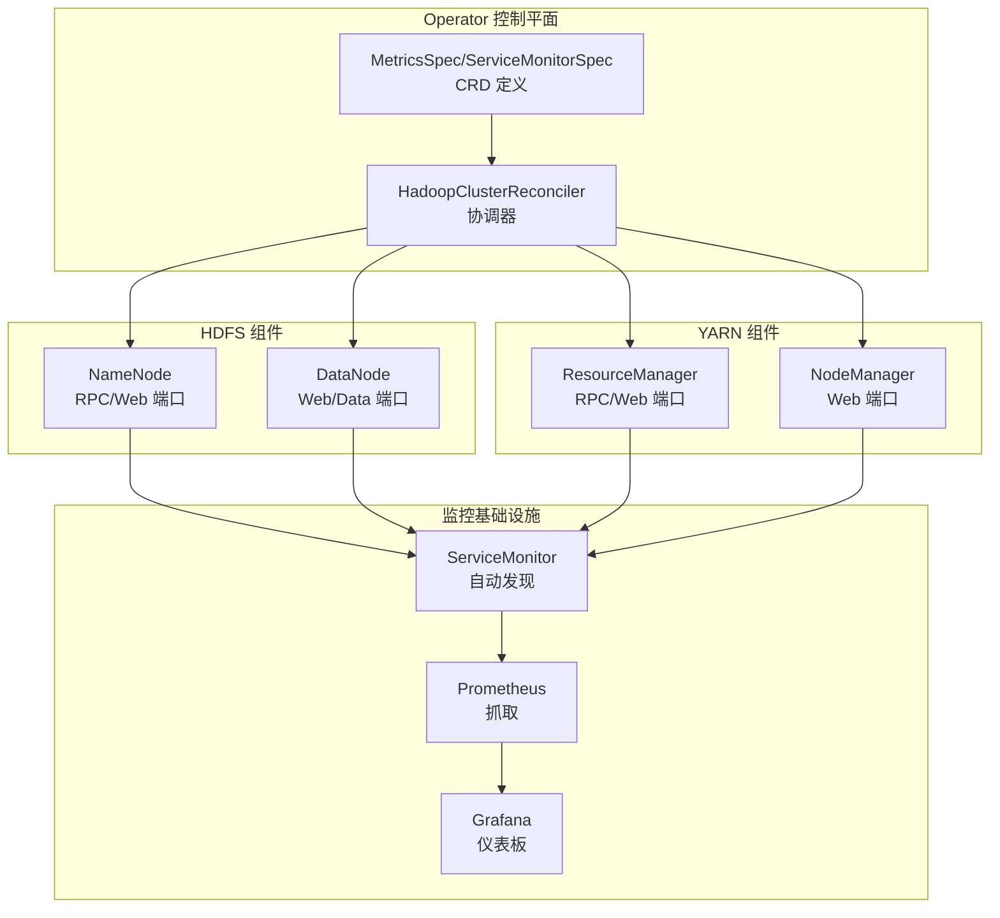
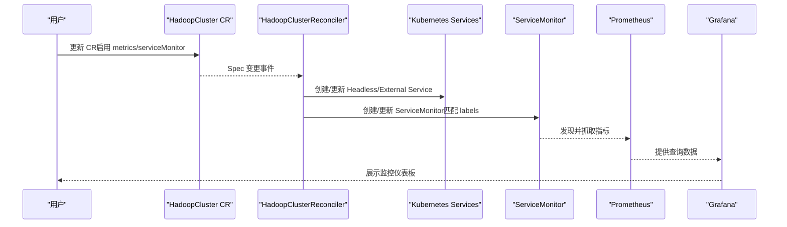
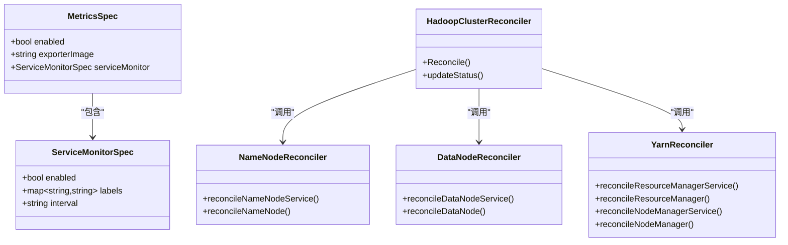

# 监控集成

<cite>
**本文引用的文件**
- [README.md](file://hadoop-operator/README.md)
- [hadoopcluster_types.go](file://hadoop-operator/api/v1/hadoopcluster_types.go)
- [hadoopcluster_controller.go](file://hadoop-operator/internal/controller/hadoopcluster_controller.go)
- [namenode.go](file://hadoop-operator/internal/reconciler/namenode.go)
- [datanode.go](file://hadoop-operator/internal/reconciler/datanode.go)
- [yarn.go](file://hadoop-operator/internal/reconciler/yarn.go)
- [hadoop_v1_hadoopcluster.yaml](file://hadoop-operator/config/samples/hadoop_v1_hadoopcluster.yaml)
- [hadoop_v1_hadoopcluster_ha.yaml](file://hadoop-operator/config/samples/hadoop_v1_hadoopcluster_ha.yaml)
- [configmap.yaml](file://configmap.yaml)
- [namenode.yaml](file://namenode.yaml)
- [datanode.yaml](file://datanode.yaml)
- [resourcemanager.yaml](file://resourcemanager.yaml)
- [nodemanager.yaml](file://nodemanager.yaml)
</cite>

## 目录
1. [简介](#简介)
2. [项目结构](#项目结构)
3. [核心组件](#核心组件)
4. [架构总览](#架构总览)
5. [详细组件分析](#详细组件分析)
6. [依赖关系分析](#依赖关系分析)
7. [性能考量](#性能考量)
8. [故障排查指南](#故障排查指南)
9. [结论](#结论)
10. [附录](#附录)

## 简介
本章节介绍 Apache Hadoop Operator v3 的监控集成功能，重点覆盖：
- Prometheus 指标导出与 ServiceMonitor 配置
- Grafana 仪表板集成建议
- 自定义指标收集与告警规则
- 关键指标含义与用途（HDFS、YARN、NameNode、DataNode）
- 监控配置示例与故障排查、性能分析方法

根据代码库内容，Operator 提供了对 Prometheus 的原生支持，可通过 CRD 中的 metrics 字段启用 ServiceMonitor，并通过 labels 匹配 Prometheus 实例，从而实现对 Hadoop 组件的自动发现与抓取。

## 项目结构
监控相关能力主要由以下部分组成：
- CRD 定义：在 HadoopClusterSpec 中新增 MetricsSpec 与 ServiceMonitorSpec，用于控制是否启用 Prometheus 指标与 ServiceMonitor。
- 控制器：HadoopClusterReconciler 负责协调各组件资源（StatefulSet、Service、ConfigMap），并维护集群状态。
- 组件协调器：分别针对 NameNode、DataNode、ResourceManager、NodeManager 创建服务与状态集，暴露 Web/RPC 端口，便于 Prometheus 抓取。
- 示例配置：提供基础与高可用两种集群样例，其中高可用样例启用了 metrics.serviceMonitor。

图表来源
- [hadoopcluster_types.go:273-295](file://hadoop-operator/api/v1/hadoopcluster_types.go#L273-L295)
- [hadoopcluster_controller.go:104-126](file://hadoop-operator/internal/controller/hadoopcluster_controller.go#L104-L126)
- [namenode.go:36-114](file://hadoop-operator/internal/reconciler/namenode.go#L36-L114)
- [datanode.go:35-113](file://hadoop-operator/internal/reconciler/datanode.go#L35-L113)
- [yarn.go:35-113](file://hadoop-operator/internal/reconciler/yarn.go#L35-L113)

章节来源
- [hadoopcluster_types.go:273-295](file://hadoop-operator/api/v1/hadoopcluster_types.go#L273-L295)
- [hadoopcluster_controller.go:104-126](file://hadoop-operator/internal/controller/hadoopcluster_controller.go#L104-L126)

## 核心组件
- 监控配置模型
  - MetricsSpec：控制是否启用 Prometheus 指标与导出器镜像。
  - ServiceMonitorSpec：控制是否创建 ServiceMonitor 及匹配标签、抓取间隔等。
- 控制器职责
  - Reconcile 循环中依次协调 ConfigMap、服务与 StatefulSet，最终更新集群状态。
  - 通过 labelsFor* 函数为各组件打上统一标签，便于 ServiceMonitor 匹配。
- 组件服务端口
  - NameNode：RPC(9000)、Web(9870)
  - DataNode：Web(9864)、Data(9866)
  - ResourceManager：RPC(8032)、Web(8088)
  - NodeManager：Web(8042)

章节来源
- [hadoopcluster_types.go:273-295](file://hadoop-operator/api/v1/hadoopcluster_types.go#L273-L295)
- [hadoopcluster_controller.go:104-126](file://hadoop-operator/internal/controller/hadoopcluster_controller.go#L104-L126)
- [namenode.go:36-114](file://hadoop-operator/internal/reconciler/namenode.go#L36-L114)
- [datanode.go:35-113](file://hadoop-operator/internal/reconciler/datanode.go#L35-L113)
- [yarn.go:35-113](file://hadoop-operator/internal/reconciler/yarn.go#L35-L113)

## 架构总览
监控集成的整体流程如下：
- 在 HadoopCluster CR 中开启 metrics.enabled 与 metrics.serviceMonitor.enabled。
- 控制器为每个组件创建 Headless Service 与外部 Service，并打上统一标签。
- Prometheus Operator 通过 ServiceMonitor 发现并抓取对应端口。
- Grafana 导入仪表板进行可视化展示。

图表来源
- [hadoop_v1_hadoopcluster_ha.yaml:101-107](file://hadoop-operator/config/samples/hadoop_v1_hadoopcluster_ha.yaml#L101-L107)
- [hadoopcluster_controller.go:104-126](file://hadoop-operator/internal/controller/hadoopcluster_controller.go#L104-L126)
- [namenode.go:36-114](file://hadoop-operator/internal/reconciler/namenode.go#L36-L114)
- [datanode.go:35-113](file://hadoop-operator/internal/reconciler/datanode.go#L35-L113)
- [yarn.go:35-113](file://hadoop-operator/internal/reconciler/yarn.go#L35-L113)

## 详细组件分析

### 监控配置模型与 CRD
- MetricsSpec
  - enabled：是否启用 Prometheus 指标导出。
  - exporterImage：可选的指标导出器镜像。
  - serviceMonitor：ServiceMonitorSpec。
- ServiceMonitorSpec
  - enabled：是否创建 ServiceMonitor。
  - labels：匹配 Prometheus 实例的标签选择器。
  - interval：抓取间隔（可选）。

章节来源
- [hadoopcluster_types.go:273-295](file://hadoop-operator/api/v1/hadoopcluster_types.go#L273-L295)

### 控制器协调流程
- Reconcile 顺序：ConfigMap → NameNode Service → NameNode → DataNode Service → DataNode → ResourceManager Service → ResourceManager → NodeManager Service → NodeManager。
- 状态更新：控制器定期更新各组件的 ReadyReplicas、Replicas 等状态字段。
- 标签策略：各组件通过 labelsFor* 返回统一标签，便于 ServiceMonitor 匹配。

章节来源
- [hadoopcluster_controller.go:104-126](file://hadoop-operator/internal/controller/hadoopcluster_controller.go#L104-L126)
- [hadoopcluster_controller.go:169-227](file://hadoop-operator/internal/controller/hadoopcluster_controller.go#L169-L227)

### NameNode 监控
- 服务端口：RPC(9000)、Web(9870)，健康探针路径为 /jmx。
- 标签：app、cluster、component、managed-by。
- 健康检查：通过 /jmx 探针判断 NameNode 是否就绪。

章节来源
- [namenode.go:36-114](file://hadoop-operator/internal/reconciler/namenode.go#L36-L114)
- [namenode.go:235-254](file://hadoop-operator/internal/reconciler/namenode.go#L235-L254)
- [namenode.go:319-326](file://hadoop-operator/internal/reconciler/namenode.go#L319-L326)

### DataNode 监控
- 服务端口：Web(9864)、Data(9866)，健康探针路径为 /。
- 标签：app、cluster、component、managed-by。
- 健康检查：通过 / 探针判断 DataNode 是否就绪。

章节来源
- [datanode.go:35-113](file://hadoop-operator/internal/reconciler/datanode.go#L35-L113)
- [datanode.go:249-268](file://hadoop-operator/internal/reconciler/datanode.go#L249-L268)
- [datanode.go:323-330](file://hadoop-operator/internal/reconciler/datanode.go#L323-L330)

### ResourceManager 监控
- 服务端口：RPC(8032)、Web(8088)，健康探针路径为 /ws/v1/cluster/info。
- 标签：app、cluster、component、managed-by。
- 健康检查：通过 /ws/v1/cluster/info 探针判断 ResourceManager 是否就绪。

章节来源
- [yarn.go:35-113](file://hadoop-operator/internal/reconciler/yarn.go#L35-L113)
- [yarn.go:189-208](file://hadoop-operator/internal/reconciler/yarn.go#L189-L208)
- [yarn.go:449-456](file://hadoop-operator/internal/reconciler/yarn.go#L449-L456)

### NodeManager 监控
- 服务端口：Web(8042)，健康探针路径为 /node。
- 标签：app、cluster、component、managed-by。
- 健康检查：通过 /node 探针判断 NodeManager 是否就绪。

章节来源
- [yarn.go:243-310](file://hadoop-operator/internal/reconciler/yarn.go#L243-L310)
- [yarn.go:396-415](file://hadoop-operator/internal/reconciler/yarn.go#L396-L415)
- [yarn.go:458-465](file://hadoop-operator/internal/reconciler/yarn.go#L458-L465)

### 监控指标含义与用途
- NameNode
  - Web 端口暴露 JMX/REST 接口，Prometheus 可通过 /jmx 或 /ws/v1/cluster/info 等路径抓取。
  - 关键用途：查看 NameNode 状态、容量、块信息、Federation 状态等。
- DataNode
  - Web 端口暴露节点状态，Prometheus 可通过 / 抓取。
  - 关键用途：查看 DataNode 健康、磁盘使用、块传输状态等。
- ResourceManager
  - Web 端口暴露集群信息与应用状态，Prometheus 可通过 /ws/v1/cluster/info 抓取。
  - 关键用途：查看资源使用、队列状态、应用数量与状态等。
- NodeManager
  - Web 端口暴露节点信息，Prometheus 可通过 /node 抓取。
  - 关键用途：查看容器/任务运行状态、资源分配与回收等。

章节来源
- [namenode.go:235-254](file://hadoop-operator/internal/reconciler/namenode.go#L235-L254)
- [datanode.go:249-268](file://hadoop-operator/internal/reconciler/datanode.go#L249-L268)
- [yarn.go:189-208](file://hadoop-operator/internal/reconciler/yarn.go#L189-L208)
- [yarn.go:396-415](file://hadoop-operator/internal/reconciler/yarn.go#L396-L415)

### ServiceMonitor 配置示例
- 在 HadoopCluster CR 中启用 metrics.serviceMonitor，并设置 labels 以匹配 Prometheus 实例。
- 控制器会为每个组件创建 Headless Service 与外部 Service，并打上统一标签，便于 ServiceMonitor 匹配。

章节来源
- [hadoop_v1_hadoopcluster_ha.yaml:101-107](file://hadoop-operator/config/samples/hadoop_v1_hadoopcluster_ha.yaml#L101-L107)
- [hadoopcluster_types.go:285-295](file://hadoop-operator/api/v1/hadoopcluster_types.go#L285-L295)

### Grafana 仪表板集成
- 建议导入官方或社区提供的 Hadoop/YARN 仪表板，或基于 Prometheus 查询语言构建自定义面板。
- 可视化维度建议：组件副本数、就绪状态、资源使用率、JVM 指标、队列与应用状态等。

（本节为通用实践建议，不直接分析具体文件）

### 自定义指标收集
- 可通过 HadoopClusterSpec.config.*Site 配置项覆盖默认配置，以满足特定监控需求。
- 若需额外指标导出器，可在 MetricsSpec.exporterImage 中指定自定义镜像。

章节来源
- [hadoopcluster_types.go:214-231](file://hadoop-operator/api/v1/hadoopcluster_types.go#L214-L231)
- [hadoopcluster_types.go:277-279](file://hadoop-operator/api/v1/hadoopcluster_types.go#L277-L279)

## 依赖关系分析
- 控制器依赖 CRD 中的 MetricsSpec/ServiceMonitorSpec 来决定是否创建 ServiceMonitor。
- 组件协调器依赖统一标签体系，确保 ServiceMonitor 能正确匹配目标服务。
- Prometheus 通过 ServiceMonitor 的 labels 选择器与抓取间隔进行指标采集。

图表来源
- [hadoopcluster_types.go:273-295](file://hadoop-operator/api/v1/hadoopcluster_types.go#L273-L295)
- [hadoopcluster_controller.go:104-126](file://hadoop-operator/internal/controller/hadoopcluster_controller.go#L104-L126)
- [namenode.go:36-114](file://hadoop-operator/internal/reconciler/namenode.go#L36-L114)
- [datanode.go:35-113](file://hadoop-operator/internal/reconciler/datanode.go#L35-L113)
- [yarn.go:35-113](file://hadoop-operator/internal/reconciler/yarn.go#L35-L113)

## 性能考量
- 抓取间隔：根据集群规模与指标复杂度调整 interval，避免过度抓取导致 Prometheus 压力。
- 健康探针：合理设置初始延迟与周期，避免频繁探测影响组件性能。
- 资源限制：为各组件设置合理的 requests/limits，保障监控与业务的资源隔离。

（本节提供通用指导，不直接分析具体文件）

## 故障排查指南
- 无法发现服务
  - 检查 HadoopCluster CR 中 metrics.serviceMonitor.enabled 与 labels 是否正确。
  - 确认控制器已创建 Headless/External Service 并带有统一标签。
- 抓取失败
  - 检查组件健康探针路径与端口是否正确（/jmx、/、/ws/v1/cluster/info、/node）。
  - 确认网络连通性与 Service 选择器匹配。
- 集群状态异常
  - 通过控制器状态更新逻辑检查 ReadyReplicas/Replicas 等字段，定位组件就绪问题。

章节来源
- [hadoop_v1_hadoopcluster_ha.yaml:101-107](file://hadoop-operator/config/samples/hadoop_v1_hadoopcluster_ha.yaml#L101-L107)
- [hadoopcluster_controller.go:169-227](file://hadoop-operator/internal/controller/hadoopcluster_controller.go#L169-L227)
- [namenode.go:235-254](file://hadoop-operator/internal/reconciler/namenode.go#L235-L254)
- [datanode.go:249-268](file://hadoop-operator/internal/reconciler/datanode.go#L249-L268)
- [yarn.go:189-208](file://hadoop-operator/internal/reconciler/yarn.go#L189-L208)
- [yarn.go:396-415](file://hadoop-operator/internal/reconciler/yarn.go#L396-L415)

## 结论
Hadoop Operator v3 通过 CRD 的 MetricsSpec 与 ServiceMonitorSpec，提供了对 Prometheus 的开箱即用支持。控制器按顺序协调各组件服务与状态集，并通过统一标签实现 ServiceMonitor 的自动发现。结合健康探针与合理的抓取策略，可有效支撑 HDFS 与 YARN 的监控可视化与告警。

## 附录

### 监控配置示例
- 基础集群示例（未启用 metrics.serviceMonitor）
  - 参考路径：[hadoop_v1_hadoopcluster.yaml:1-80](file://hadoop-operator/config/samples/hadoop_v1_hadoopcluster.yaml#L1-L80)
- 高可用集群示例（启用 metrics.serviceMonitor）
  - 参考路径：[hadoop_v1_hadoopcluster_ha.yaml:101-107](file://hadoop-operator/config/samples/hadoop_v1_hadoopcluster_ha.yaml#L101-L107)

### 关键端口与探针
- NameNode：RPC(9000)、Web(9870)，探针路径 /jmx
- DataNode：Web(9864)、Data(9866)，探针路径 /
- ResourceManager：RPC(8032)、Web(8088)，探针路径 /ws/v1/cluster/info
- NodeManager：Web(8042)，探针路径 /node

章节来源
- [namenode.go:36-114](file://hadoop-operator/internal/reconciler/namenode.go#L36-L114)
- [datanode.go:35-113](file://hadoop-operator/internal/reconciler/datanode.go#L35-L113)
- [yarn.go:35-113](file://hadoop-operator/internal/reconciler/yarn.go#L35-L113)