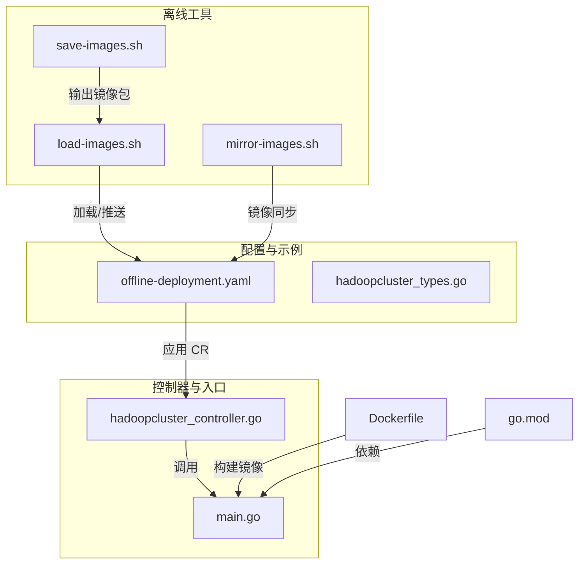
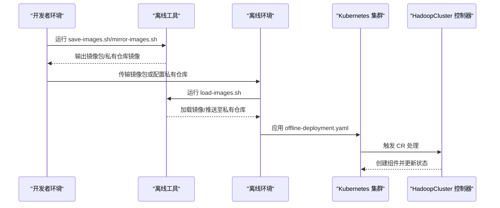
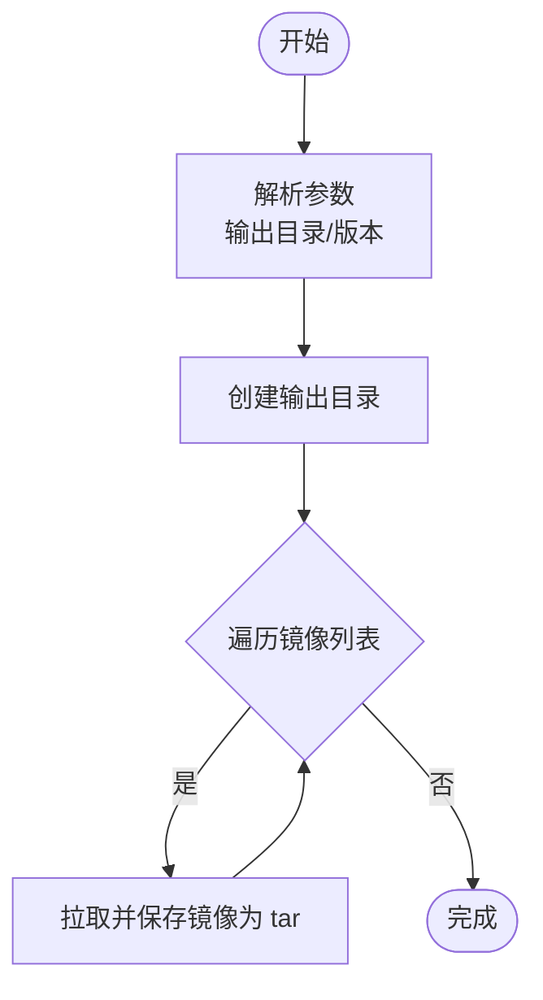
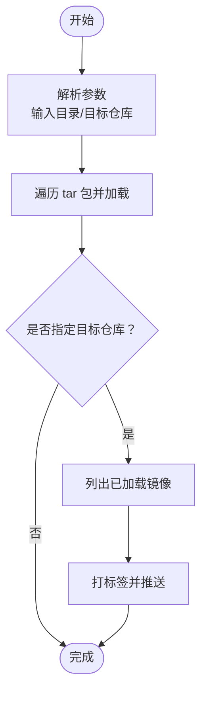
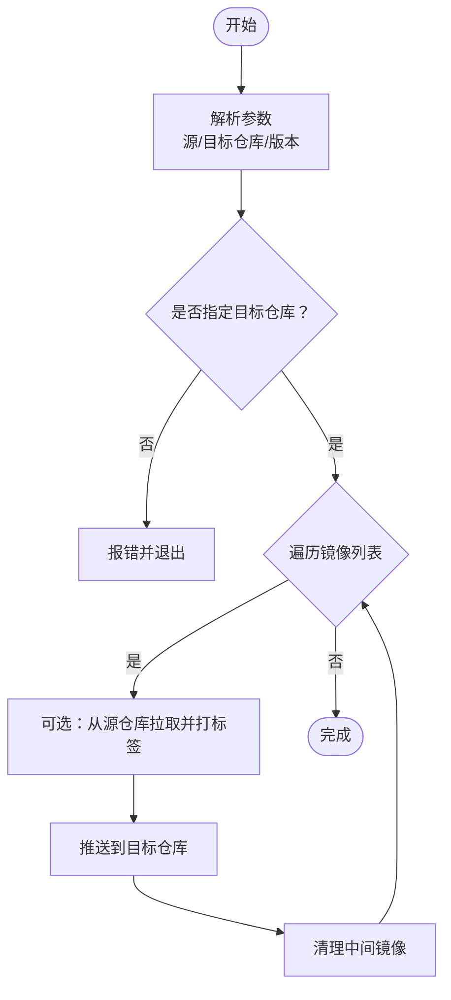
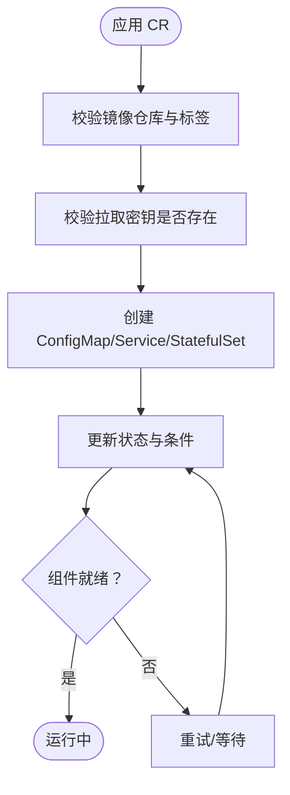
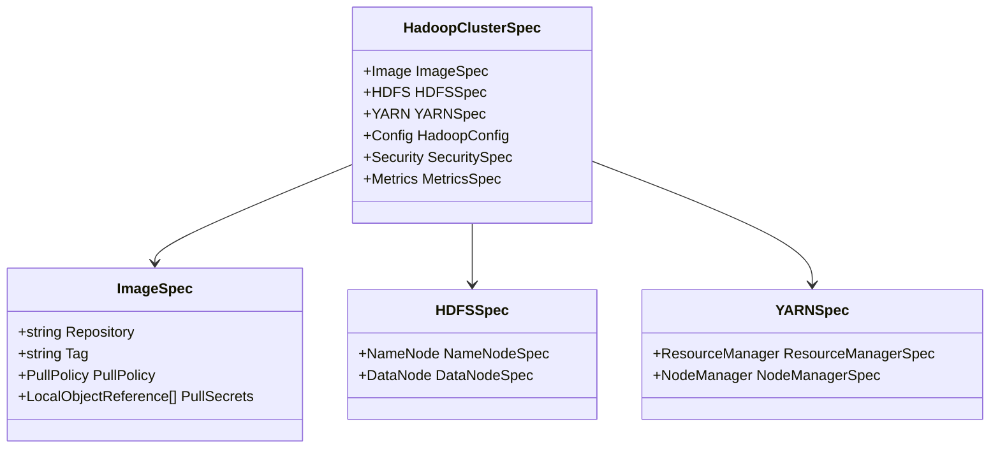
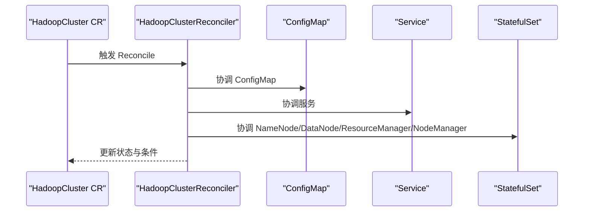
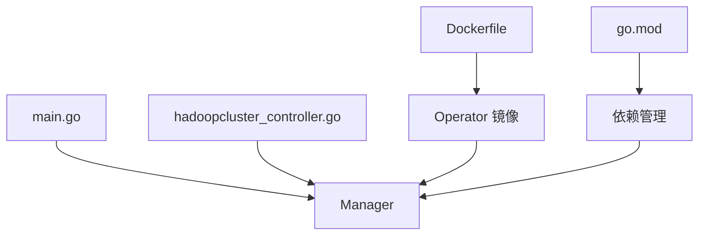

# 离线部署

<cite>
**本文引用的文件**
- [README.md](file://README.md)
- [save-images.sh](file://hack/offline/save-images.sh)
- [load-images.sh](file://hack/offline/load-images.sh)
- [mirror-images.sh](file://hack/offline/mirror-images.sh)
- [offline-deployment.yaml](file://config/samples/offline-deployment.yaml)
- [hadoopcluster_types.go](file://api/v1/hadoopcluster_types.go)
- [hadoopcluster_controller.go](file://internal/controller/hadoopcluster_controller.go)
- [main.go](file://cmd/main.go)
- [Dockerfile](file://Dockerfile)
- [go.mod](file://go.mod)
</cite>

## 目录
1. [简介](#简介)
2. [项目结构](#项目结构)
3. [核心组件](#核心组件)
4. [架构总览](#架构总览)
5. [详细组件分析](#详细组件分析)
6. [依赖分析](#依赖分析)
7. [性能考虑](#性能考虑)
8. [故障排查指南](#故障排查指南)
9. [结论](#结论)
10. [附录](#附录)

## 简介
本文件系统性介绍 Apache Hadoop Operator v3 的离线部署能力，覆盖私有镜像仓库配置、镜像打包与分发、离线环境部署流程、网络隔离环境支持等。重点解释离线部署工具链的使用方法，包括镜像保存、镜像加载、镜像同步等脚本工具；提供完整的离线部署指南，包括环境准备、镜像管理、部署验证等步骤；并总结私有云和内网环境的部署最佳实践。

## 项目结构
离线部署能力主要由以下部分组成：
- 离线工具脚本：位于 hack/offline 目录，提供镜像保存、镜像加载、镜像同步三类工具。
- 离线部署示例：位于 config/samples，提供 offline-deployment.yaml 作为离线环境部署参考。
- CRD 类型定义：位于 api/v1，描述 HadoopCluster CR 的镜像与部署参数。
- 控制器与入口：位于 internal/controller 与 cmd/main.go，负责根据 CR 驱动集群创建与状态更新。
- 构建与依赖：Dockerfile 与 go.mod 描述镜像构建与依赖关系。

图表来源
- [save-images.sh](file://hack/offline/save-images.sh)
- [load-images.sh](file://hack/offline/load-images.sh)
- [mirror-images.sh](file://hack/offline/mirror-images.sh)
- [offline-deployment.yaml](file://config/samples/offline-deployment.yaml)
- [hadoopcluster_types.go](file://api/v1/hadoopcluster_types.go)
- [hadoopcluster_controller.go](file://internal/controller/hadoopcluster_controller.go)
- [main.go](file://cmd/main.go)
- [Dockerfile](file://Dockerfile)
- [go.mod](file://go.mod)

章节来源
- [README.md](file://README.md)
- [save-images.sh](file://hack/offline/save-images.sh)
- [load-images.sh](file://hack/offline/load-images.sh)
- [mirror-images.sh](file://hack/offline/mirror-images.sh)
- [offline-deployment.yaml](file://config/samples/offline-deployment.yaml)
- [hadoopcluster_types.go](file://api/v1/hadoopcluster_types.go)
- [hadoopcluster_controller.go](file://internal/controller/hadoopcluster_controller.go)
- [main.go](file://cmd/main.go)
- [Dockerfile](file://Dockerfile)
- [go.mod](file://go.mod)

## 核心组件
- 离线镜像保存工具：从公共仓库拉取所需镜像并导出为 tar 包，便于离线传输。
- 离线镜像加载工具：从 tar 包加载镜像，或在指定目标仓库存在时直接推送到私有仓库。
- 离线镜像同步工具：将源仓库镜像镜像到目标私有仓库，支持可选的代理源仓库。
- 离线部署示例：提供镜像仓库、镜像标签、拉取策略、拉取密钥、HA 与存储等配置示例。
- CRD 类型定义：明确镜像配置字段（仓库、标签、拉取策略、拉取密钥）与 HDFS/YARN 组件规格。
- 控制器与入口：根据 CR 驱动组件创建、状态更新与健康检查。

章节来源
- [README.md](file://README.md)
- [save-images.sh](file://hack/offline/save-images.sh)
- [load-images.sh](file://hack/offline/load-images.sh)
- [mirror-images.sh](file://hack/offline/mirror-images.sh)
- [offline-deployment.yaml](file://config/samples/offline-deployment.yaml)
- [hadoopcluster_types.go](file://api/v1/hadoopcluster_types.go)
- [hadoopcluster_controller.go](file://internal/controller/hadoopcluster_controller.go)
- [main.go](file://cmd/main.go)

## 架构总览
离线部署的总体流程如下：
- 准备阶段：在有网络的环境中使用 save-images.sh 导出镜像包，或使用 mirror-images.sh 将镜像同步至私有仓库。
- 传输阶段：将镜像包或私有仓库中的镜像在离线环境中可用。
- 加载阶段：在离线环境中使用 load-images.sh 加载镜像，或直接使用私有仓库镜像。
- 部署阶段：应用 offline-deployment.yaml，控制器根据 CR 驱动集群创建与状态更新。

图表来源
- [save-images.sh](file://hack/offline/save-images.sh)
- [load-images.sh](file://hack/offline/load-images.sh)
- [mirror-images.sh](file://hack/offline/mirror-images.sh)
- [offline-deployment.yaml](file://config/samples/offline-deployment.yaml)
- [hadoopcluster_controller.go](file://internal/controller/hadoopcluster_controller.go)

## 详细组件分析

### 离线镜像保存工具（save-images.sh）
- 功能概述：从公共仓库拉取 Hadoop 与 ZooKeeper 镜像，保存为 tar 包，便于离线传输。
- 关键行为：
  - 支持自定义输出目录与 Hadoop 版本参数。
  - 自动创建输出目录并逐个拉取与保存镜像。
  - 提供加载镜像的后续命令提示。
- 使用场景：在有网络的环境中批量导出镜像，打包后传输到离线环境。

图表来源
- [save-images.sh](file://hack/offline/save-images.sh)

章节来源
- [save-images.sh](file://hack/offline/save-images.sh)

### 离线镜像加载工具（load-images.sh）
- 功能概述：从 tar 包加载镜像，或在指定目标仓库时将已加载镜像打标签并推送到私有仓库。
- 关键行为：
  - 支持输入目录与目标私有仓库参数。
  - 遍历输入目录下的 tar 包并执行 docker load。
  - 可选地对已加载镜像进行打标签与推送。
- 使用场景：在离线环境中加载镜像包，或直接将镜像推送到私有仓库以供集群使用。

图表来源
- [load-images.sh](file://hack/offline/load-images.sh)

章节来源
- [load-images.sh](file://hack/offline/load-images.sh)

### 离线镜像同步工具（mirror-images.sh）
- 功能概述：将源仓库镜像镜像到目标私有仓库，支持可选的代理源仓库，便于跨网络环境同步。
- 关键行为：
  - 支持源仓库、目标仓库、Hadoop 版本等参数。
  - 对每个镜像执行拉取、打标签、推送与清理。
  - 输出更新后的 CR 示例片段，便于直接应用。
- 使用场景：在具备网络访问的环境中，将镜像同步到私有仓库，供离线环境使用。

图表来源
- [mirror-images.sh](file://hack/offline/mirror-images.sh)

章节来源
- [mirror-images.sh](file://hack/offline/mirror-images.sh)

### 离线部署示例（offline-deployment.yaml）
- 功能概述：提供离线环境部署的 HadoopCluster CR 示例，包含镜像仓库、镜像标签、拉取策略、拉取密钥、HA 与存储等配置。
- 关键配置点：
  - image.repository：私有仓库地址与镜像路径。
  - image.tag：镜像标签。
  - image.pullPolicy：拉取策略。
  - image.pullSecrets：镜像拉取密钥名称。
  - hdfs.nameNode.ha.zookeeper.connectionString：外部 ZooKeeper 连接串（离线环境已部署时使用）。
  - metrics.exporterImage：Prometheus 导出器镜像（可指向私有仓库）。
- 使用场景：直接应用该 CR，在离线环境中完成 Hadoop 集群部署。

图表来源
- [offline-deployment.yaml](file://config/samples/offline-deployment.yaml)
- [hadoopcluster_controller.go](file://internal/controller/hadoopcluster_controller.go)

章节来源
- [offline-deployment.yaml](file://config/samples/offline-deployment.yaml)

### CRD 类型定义（hadoopcluster_types.go）
- 功能概述：定义 HadoopCluster CR 的结构，包括镜像配置、HDFS/YARN 组件规格、配置覆盖、安全与监控等。
- 关键类型：
  - ImageSpec：镜像仓库、标签、拉取策略、拉取密钥。
  - HDFSSpec/NameNodeSpec/DataNodeSpec：HDFS 组件规格与 HA/JournalNode 配置。
  - YARNSpec/ResourceManagerSpec/NodeManagerSpec：YARN 组件规格与 HA 配置。
  - MetricsSpec：监控与导出器镜像配置。
- 使用场景：在离线部署中，通过 CR 的镜像配置字段指定私有仓库与镜像标签。

图表来源
- [hadoopcluster_types.go](file://api/v1/hadoopcluster_types.go)

章节来源
- [hadoopcluster_types.go](file://api/v1/hadoopcluster_types.go)

### 控制器与入口（hadoopcluster_controller.go、main.go）
- 功能概述：控制器根据 CR 驱动组件创建与状态更新；入口负责初始化日志、指标、健康检查与管理器启动。
- 关键行为：
  - Reconcile：按顺序协调 ConfigMap、服务、NameNode、DataNode、ResourceManager、NodeManager。
  - 状态更新：记录各组件副本数与就绪状态，设置集群条件。
  - 入口：设置指标、健康探针、Webhook TLS、LeaderElect 等。
- 使用场景：在离线环境中，控制器依据 CR 配置创建与维护 Hadoop 组件。

图表来源
- [hadoopcluster_controller.go](file://internal/controller/hadoopcluster_controller.go)
- [main.go](file://cmd/main.go)

章节来源
- [hadoopcluster_controller.go](file://internal/controller/hadoopcluster_controller.go)
- [main.go](file://cmd/main.go)

## 依赖分析
- 构建与镜像：Dockerfile 定义多阶段构建与最小基础镜像；go.mod 管理依赖版本。
- 控制器运行：main.go 初始化日志、指标、健康检查与管理器；控制器依赖 CRD 类型定义。
- 离线工具：三个脚本独立运行，互不依赖，分别处理镜像保存、加载与同步。

图表来源
- [Dockerfile](file://Dockerfile)
- [go.mod](file://go.mod)
- [main.go](file://cmd/main.go)
- [hadoopcluster_controller.go](file://internal/controller/hadoopcluster_controller.go)

章节来源
- [Dockerfile](file://Dockerfile)
- [go.mod](file://go.mod)
- [main.go](file://cmd/main.go)
- [hadoopcluster_controller.go](file://internal/controller/hadoopcluster_controller.go)

## 性能考虑
- 镜像体积与传输效率：离线工具默认保存 Hadoop 与 ZooKeeper 镜像，建议在有网络环境中优先使用镜像同步工具将镜像推送到私有仓库，减少重复下载与传输。
- 镜像加载与推送：离线环境中加载镜像包后，如需进一步推送到私有仓库，应评估网络带宽与存储空间，避免并发大量推送导致资源争用。
- 集群组件规模：离线部署示例中 HDFS 与 YARN 组件的副本数与资源请求/限制直接影响集群启动时间与稳定性，建议结合实际资源规划合理配置。

## 故障排查指南
- 镜像拉取失败：
  - 检查镜像仓库地址与标签是否正确。
  - 确认拉取密钥是否存在且命名空间匹配。
  - 在离线环境中确认镜像已成功加载或已推送到私有仓库。
- 组件启动失败：
  - 查看对应 Pod 的事件与日志，定位具体错误。
  - 检查 PVC 状态与存储类配置。
- NameNode 格式化失败：
  - 检查 PVC 是否绑定成功，必要时手动格式化（谨慎操作）。
- DataNode 无法连接 NameNode：
  - 检查网络连通性与服务端口映射。
  - 校验配置文件与服务发现配置。

章节来源
- [README.md](file://README.md)

## 结论
Apache Hadoop Operator v3 提供完善的离线部署能力，通过离线镜像保存、加载与同步工具，结合 CRD 的镜像配置与离线部署示例，可在私有云与内网环境中高效完成 Hadoop 集群的部署与运维。建议在有网络环境中统一使用镜像同步工具集中管理镜像，离线环境中采用加载工具快速恢复镜像可用性，并通过 CR 的镜像配置与拉取密钥保障集群稳定运行。

## 附录
- 离线部署最佳实践：
  - 在有网络环境中统一使用镜像同步工具，集中管理镜像版本与私有仓库。
  - 离线环境中优先使用加载工具一次性恢复镜像，减少重复操作。
  - 通过 CR 的镜像配置与拉取密钥确保集群能够正确拉取镜像。
  - 在网络隔离环境下，提前准备外部 ZooKeeper 连接串，避免内部 ZooKeeper 部署带来的额外复杂度。
  - 结合监控配置与导出器镜像，确保离线环境也能获得可观测性数据。