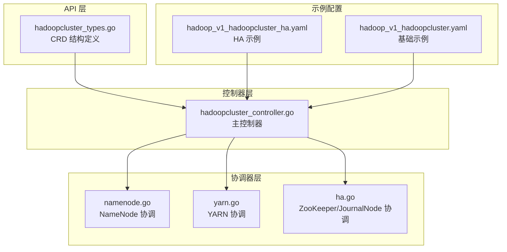
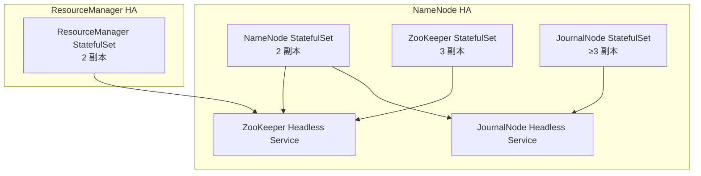
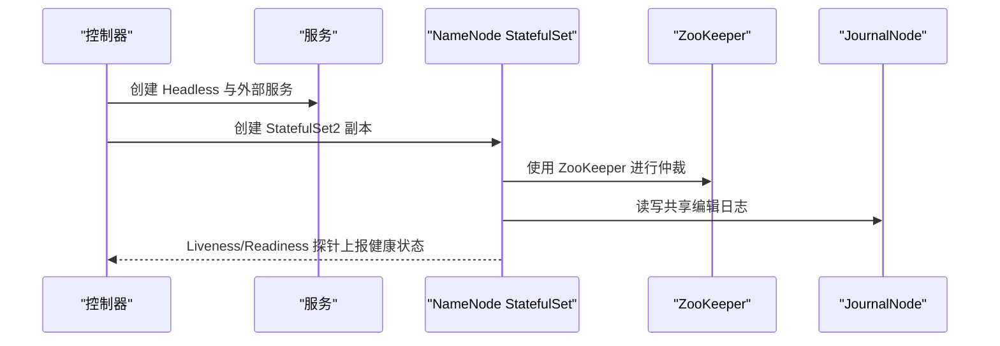
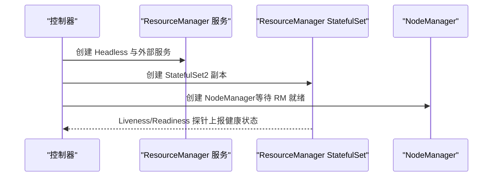
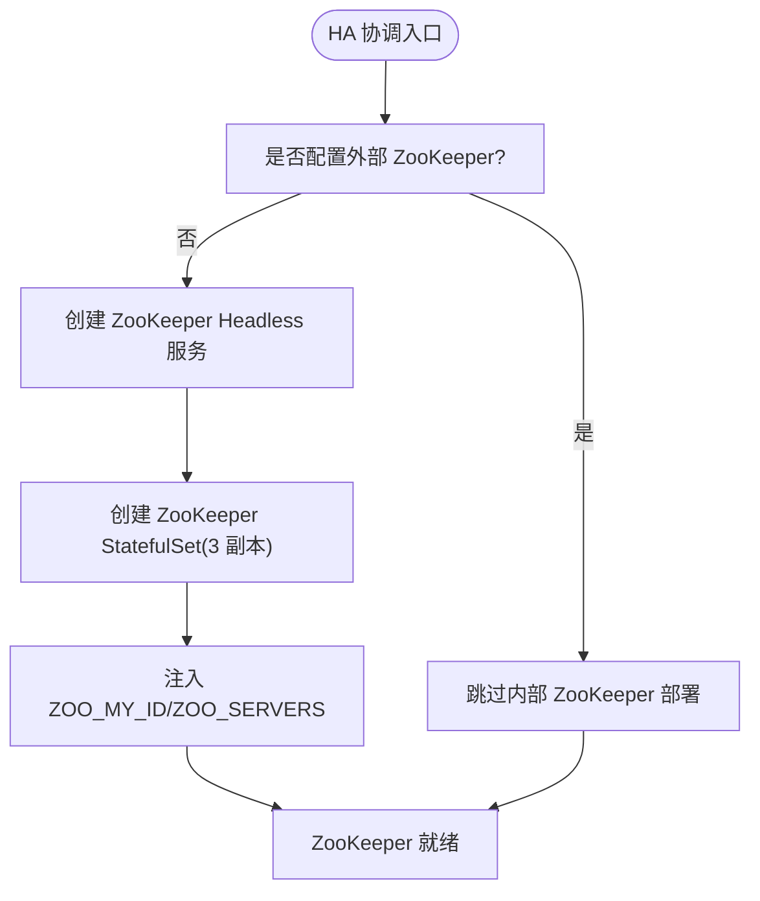
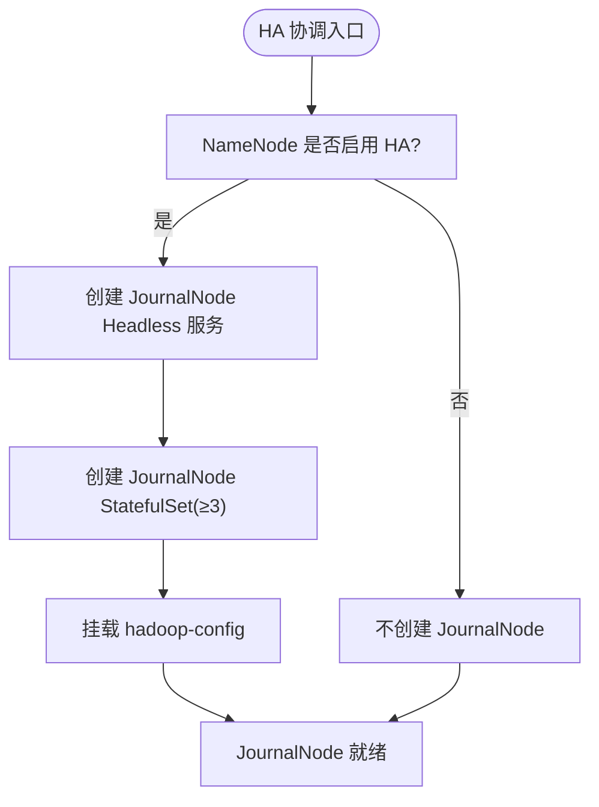
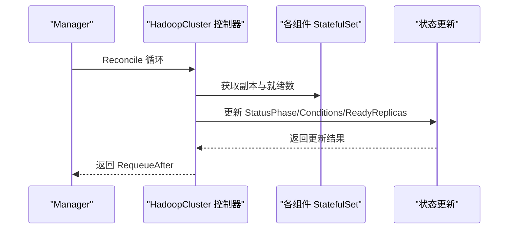
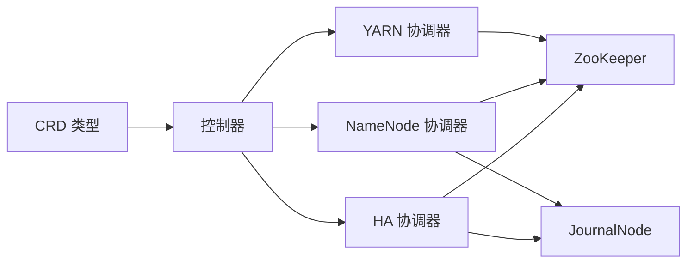

# 高可用架构

<cite>
**本文引用的文件列表**
- [hadoopcluster_types.go](file://hadoop-operator/api/v1/hadoopcluster_types.go)
- [ha.go](file://hadoop-operator/internal/reconciler/ha.go)
- [namenode.go](file://hadoop-operator/internal/reconciler/namenode.go)
- [yarn.go](file://hadoop-operator/internal/reconciler/yarn.go)
- [hadoopcluster_controller.go](file://hadoop-operator/internal/controller/hadoopcluster_controller.go)
- [hadoop_v1_hadoopcluster_ha.yaml](file://hadoop-operator/config/samples/hadoop_v1_hadoopcluster_ha.yaml)
- [hadoop_v1_hadoopcluster.yaml](file://hadoop-operator/config/samples/hadoop_v1_hadoopcluster.yaml)
- [main.go](file://hadoop-operator/cmd/main.go)
- [README.md](file://hadoop-operator/README.md)
</cite>

## 目录
1. [简介](#简介)
2. [项目结构](#项目结构)
3. [核心组件](#核心组件)
4. [架构总览](#架构总览)
5. [详细组件分析](#详细组件分析)
6. [依赖关系分析](#依赖关系分析)
7. [性能考虑](#性能考虑)
8. [故障排查指南](#故障排查指南)
9. [结论](#结论)
10. [附录](#附录)

## 简介
本文件系统性介绍 Apache Hadoop Operator v3 的高可用架构配置与实现，重点覆盖：
- NameNode 高可用（HA）与故障转移
- ResourceManager 高可用（HA）
- ZooKeeper 集群部署与服务发现
- JournalNode 配置与仲裁
- 自动故障检测与恢复流程
- 性能优化与最佳实践

该 Operator 通过 CRD 描述 Hadoop 集群，控制器按顺序协调各组件（NameNode、DataNode、ResourceManager、NodeManager），并在 HA 模式下自动部署 ZooKeeper 与 JournalNode，并进行健康检查与状态更新。

## 项目结构
- CRD 定义位于 api/v1，描述 HadoopCluster 规格、状态与配置
- 控制器位于 internal/controller，负责资源协调与状态更新
- 协调器位于 internal/reconciler，分别处理 NameNode、YARN、HA 组件
- 示例配置位于 config/samples，包含 HA 与非 HA 的集群样例

图表来源
- [hadoopcluster_types.go:1-418](file://hadoop-operator/api/v1/hadoopcluster_types.go#L1-L418)
- [hadoopcluster_controller.go:1-239](file://hadoop-operator/internal/controller/hadoopcluster_controller.go#L1-L239)
- [namenode.go:1-371](file://hadoop-operator/internal/reconciler/namenode.go#L1-L371)
- [yarn.go:1-466](file://hadoop-operator/internal/reconciler/yarn.go#L1-L466)
- [ha.go:1-394](file://hadoop-operator/internal/reconciler/ha.go#L1-L394)
- [hadoop_v1_hadoopcluster_ha.yaml:1-107](file://hadoop-operator/config/samples/hadoop_v1_hadoopcluster_ha.yaml#L1-L107)
- [hadoop_v1_hadoopcluster.yaml:1-80](file://hadoop-operator/config/samples/hadoop_v1_hadoopcluster.yaml#L1-L80)

章节来源
- [hadoopcluster_types.go:1-418](file://hadoop-operator/api/v1/hadoopcluster_types.go#L1-L418)
- [hadoopcluster_controller.go:1-239](file://hadoop-operator/internal/controller/hadoopcluster_controller.go#L1-L239)

## 核心组件
- HadoopCluster CRD：定义镜像、HDFS、YARN、配置覆盖、安全、指标等规格
- HadoopCluster 控制器：按顺序协调 ConfigMap、服务、StatefulSet 等资源
- 协调器：
  - NameNode 协调：创建 Headless 与外部服务、StatefulSet，配置探针与存储
  - YARN 协调：ResourceManager 与 NodeManager 的服务与 StatefulSet
  - HA 协调：ZooKeeper 内部部署与服务发现；JournalNode 集群与仲裁

章节来源
- [hadoopcluster_types.go:24-46](file://hadoop-operator/api/v1/hadoopcluster_types.go#L24-L46)
- [hadoopcluster_controller.go:104-126](file://hadoop-operator/internal/controller/hadoopcluster_controller.go#L104-L126)
- [ha.go:34-177](file://hadoop-operator/internal/reconciler/ha.go#L34-L177)
- [namenode.go:116-317](file://hadoop-operator/internal/reconciler/namenode.go#L116-L317)
- [yarn.go:115-240](file://hadoop-operator/internal/reconciler/yarn.go#L115-L240)

## 架构总览
下图展示 HA 模式下的核心组件交互：NameNode HA 依赖 ZooKeeper 进行仲裁，JournalNode 提供共享编辑日志，ResourceManager HA 通过副本实现高可用。

图表来源
- [ha.go:34-177](file://hadoop-operator/internal/reconciler/ha.go#L34-L177)
- [ha.go:179-363](file://hadoop-operator/internal/reconciler/ha.go#L179-L363)
- [namenode.go:116-317](file://hadoop-operator/internal/reconciler/namenode.go#L116-L317)
- [yarn.go:115-240](file://hadoop-operator/internal/reconciler/yarn.go#L115-L240)

## 详细组件分析

### NameNode 高可用（HA）
- 副本数：HA 模式下至少 2 个 NameNode
- 服务类型：Headless 服务用于稳定网络标识；外部服务暴露 RPC/Web 端口
- 存储：PVC 动态分配，支持 StorageClass 与访问模式
- 探针：HTTP 探针检查 /jmx，延迟与周期可配置
- 初始化脚本：HA 模式下仅首个 Pod 执行格式化，后续实例复用已有版本文件
- 抗亲和性：示例中通过反亲和避免同主机部署

图表来源
- [namenode.go:35-114](file://hadoop-operator/internal/reconciler/namenode.go#L35-L114)
- [namenode.go:116-317](file://hadoop-operator/internal/reconciler/namenode.go#L116-L317)
- [hadoop_v1_hadoopcluster_ha.yaml:12-42](file://hadoop-operator/config/samples/hadoop_v1_hadoopcluster_ha.yaml#L12-L42)

章节来源
- [namenode.go:116-317](file://hadoop-operator/internal/reconciler/namenode.go#L116-L317)
- [hadoop_v1_hadoopcluster_ha.yaml:12-42](file://hadoop-operator/config/samples/hadoop_v1_hadoopcluster_ha.yaml#L12-L42)

### ResourceManager 高可用（HA）
- 副本数：HA 模式下至少 2 个 ResourceManager
- 服务类型：Headless 与外部服务，暴露 RPC/Web 端口
- 探针：HTTP 探针检查 /ws/v1/cluster/info
- NodeManager 依赖：NodeManager 启动前等待 ResourceManager 就绪

图表来源
- [yarn.go:34-113](file://hadoop-operator/internal/reconciler/yarn.go#L34-L113)
- [yarn.go:115-240](file://hadoop-operator/internal/reconciler/yarn.go#L115-L240)
- [yarn.go:312-447](file://hadoop-operator/internal/reconciler/yarn.go#L312-L447)

章节来源
- [yarn.go:115-240](file://hadoop-operator/internal/reconciler/yarn.go#L115-L240)
- [yarn.go:312-447](file://hadoop-operator/internal/reconciler/yarn.go#L312-L447)
- [hadoop_v1_hadoopcluster_ha.yaml:56-88](file://hadoop-operator/config/samples/hadoop_v1_hadoopcluster_ha.yaml#L56-L88)

### ZooKeeper 集群部署与服务发现
- 外部 ZooKeeper：若提供连接串则跳过内部部署
- 内部 ZooKeeper：Headless 服务暴露客户端、peer、election 端口；StatefulSet 3 副本
- 环境变量：ZOO_MY_ID、ZOO_SERVERS 由 Pod 名称与服务域名生成
- 存储：PVC 动态分配，默认 10Gi

图表来源
- [ha.go:34-177](file://hadoop-operator/internal/reconciler/ha.go#L34-L177)
- [ha.go:383-393](file://hadoop-operator/internal/reconciler/ha.go#L383-L393)

章节来源
- [ha.go:34-177](file://hadoop-operator/internal/reconciler/ha.go#L34-L177)
- [ha.go:383-393](file://hadoop-operator/internal/reconciler/ha.go#L383-L393)

### JournalNode 配置与仲裁
- 仲裁：JournalNode 至少 3 个副本以形成法定人数
- 服务：Headless 服务暴露 RPC/Web 端口
- 存储：PVC 动态分配，默认 20Gi
- 探针：HTTP 探针检查根路径，延迟与周期可配置
- 与 NameNode：NameNode HA 通过 JournalNode 同步编辑日志

图表来源
- [ha.go:179-363](file://hadoop-operator/internal/reconciler/ha.go#L179-L363)

章节来源
- [ha.go:179-363](file://hadoop-operator/internal/reconciler/ha.go#L179-L363)

### 故障检测与恢复流程
- 健康检查：NameNode/ResourceManager/NodeManager/NodeManager 探针定期检查
- 状态更新：控制器周期性更新集群状态（Phase、Conditions、各组件就绪数）
- 就绪判断：所有组件至少有一个就绪副本即视为运行中
- 健康端点：Manager 提供 healthz/readyz 探针

图表来源
- [hadoopcluster_controller.go:104-144](file://hadoop-operator/internal/controller/hadoopcluster_controller.go#L104-L144)
- [hadoopcluster_controller.go:176-227](file://hadoop-operator/internal/controller/hadoopcluster_controller.go#L176-L227)
- [main.go:135-142](file://hadoop-operator/cmd/main.go#L135-L142)

章节来源
- [hadoopcluster_controller.go:104-144](file://hadoop-operator/internal/controller/hadoopcluster_controller.go#L104-L144)
- [hadoopcluster_controller.go:176-227](file://hadoop-operator/internal/controller/hadoopcluster_controller.go#L176-L227)
- [main.go:135-142](file://hadoop-operator/cmd/main.go#L135-L142)

## 依赖关系分析
- 控制器依赖 CRD 类型定义与协调器模块
- 协调器依赖 Kubernetes API（Service、StatefulSet、ConfigMap、PVC）
- ZooKeeper 与 JournalNode 作为 NameNode HA 的基础设施被协调器创建
- ResourceManager 依赖 ZooKeeper（通过 Hadoop 配置）与 NodeManager

图表来源
- [hadoopcluster_types.go:1-418](file://hadoop-operator/api/v1/hadoopcluster_types.go#L1-L418)
- [hadoopcluster_controller.go:1-239](file://hadoop-operator/internal/controller/hadoopcluster_controller.go#L1-L239)
- [ha.go:1-394](file://hadoop-operator/internal/reconciler/ha.go#L1-L394)
- [namenode.go:1-371](file://hadoop-operator/internal/reconciler/namenode.go#L1-L371)
- [yarn.go:1-466](file://hadoop-operator/internal/reconciler/yarn.go#L1-L466)

章节来源
- [hadoopcluster_controller.go:1-239](file://hadoop-operator/internal/controller/hadoopcluster_controller.go#L1-L239)

## 性能考虑
- 资源配额：NameNode/ResourceManager/NodeManager 均提供 requests/limits 配置，建议根据数据规模与并发任务量调整
- 存储：JournalNode 默认 20Gi，NameNode 默认 100Gi，DataNode 默认 500Gi，可根据实际容量规划
- 反亲和性：示例中使用反亲和避免同节点部署，提升容灾能力
- 探针参数：适当延长 InitialDelaySeconds 与 PeriodSeconds，减少频繁探测开销
- 网络：Headless 服务确保稳定的 Pod 网络标识，避免 DNS 缓存导致的服务发现异常

## 故障排查指南
- Pod 启动失败：查看 Pod 事件与上一次容器日志
- NameNode 格式化失败：检查 PVC 状态，必要时手动执行格式化（谨慎操作）
- DataNode 无法连接 NameNode：检查网络连通性与配置
- 镜像拉取失败：确认镜像存在与拉取 Secret 配置正确
- 集群状态：使用 kubectl get hadoopcluster 与 kubectl get pods 查看组件状态

章节来源
- [README.md:276-318](file://hadoop-operator/README.md#L276-L318)

## 结论
Hadoop Operator v3 通过 CRD 与控制器实现了 HDFS 与 YARN 的高可用部署，结合 ZooKeeper 与 JournalNode 实现了 NameNode 与 ResourceManager 的仲裁与故障转移。其配置简洁、自动化程度高，适合在 Kubernetes 上规模化部署与运维 Hadoop 集群。

## 附录

### HA 配置示例要点
- NameNode HA：设置 replicas=2，启用 HA，配置 JournalNode replicas≥3 与存储
- ResourceManager HA：设置 replicas=2，启用 HA
- ZooKeeper：未提供外部连接串时自动部署 3 副本
- 反亲和性：示例中为 NameNode 与 ResourceManager 配置反亲和，避免同主机部署

章节来源
- [hadoop_v1_hadoopcluster_ha.yaml:12-88](file://hadoop-operator/config/samples/hadoop_v1_hadoopcluster_ha.yaml#L12-L88)