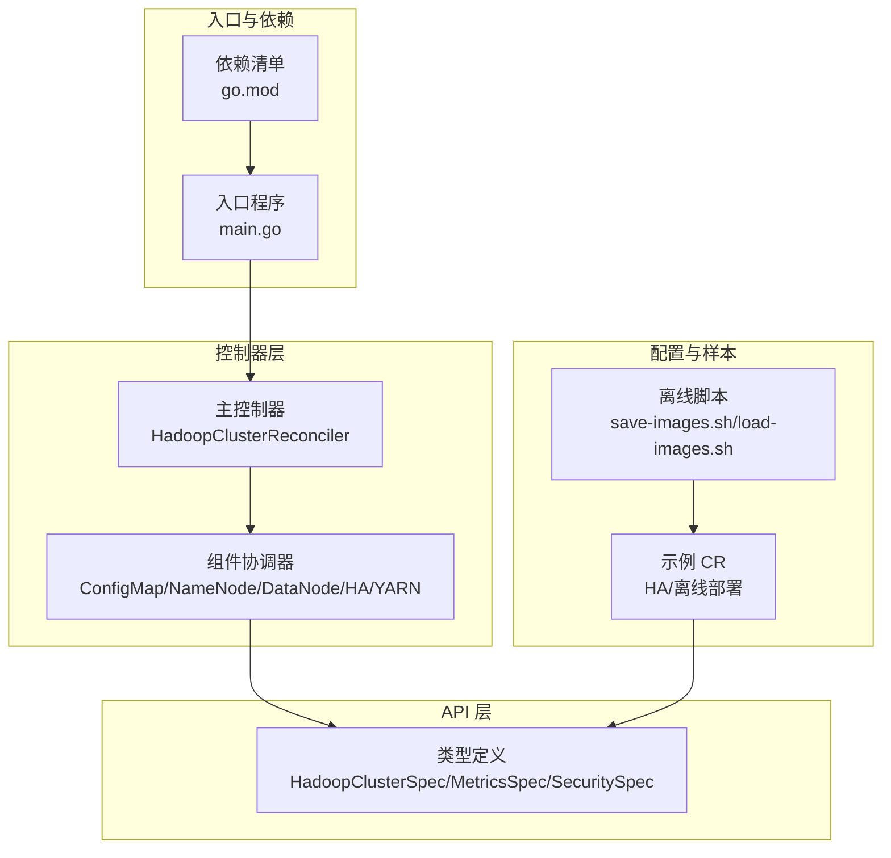
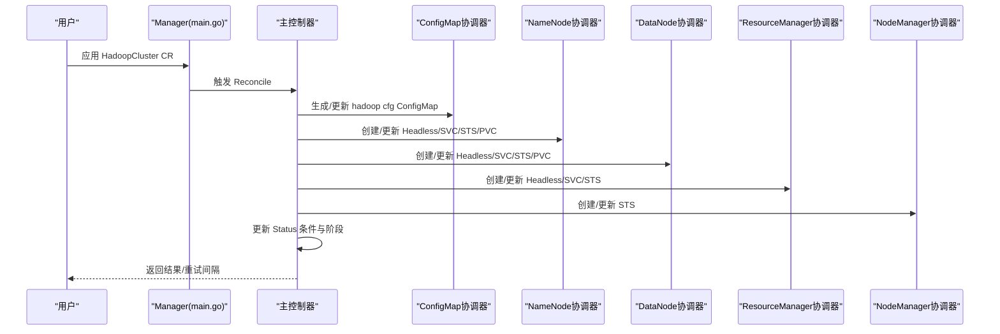
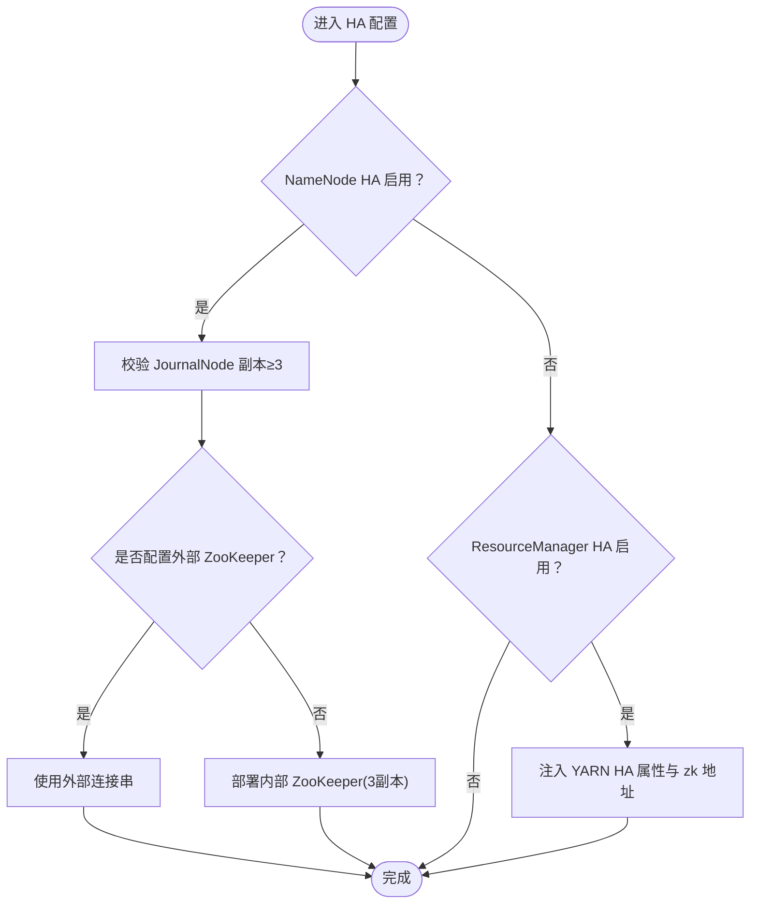
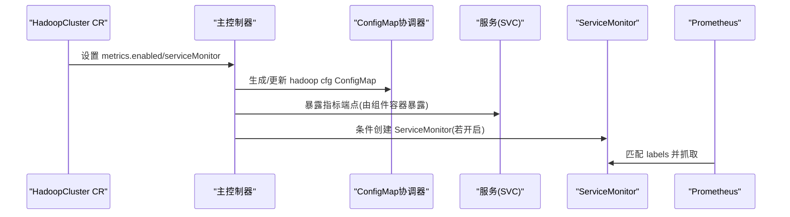
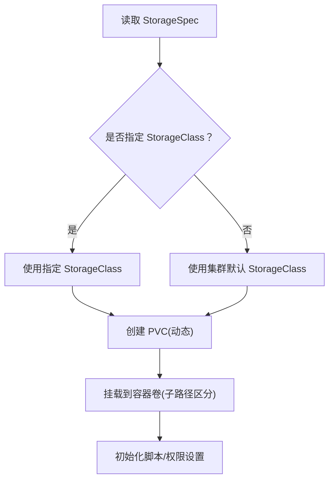
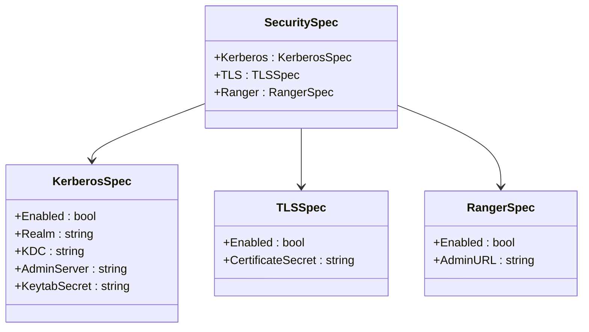
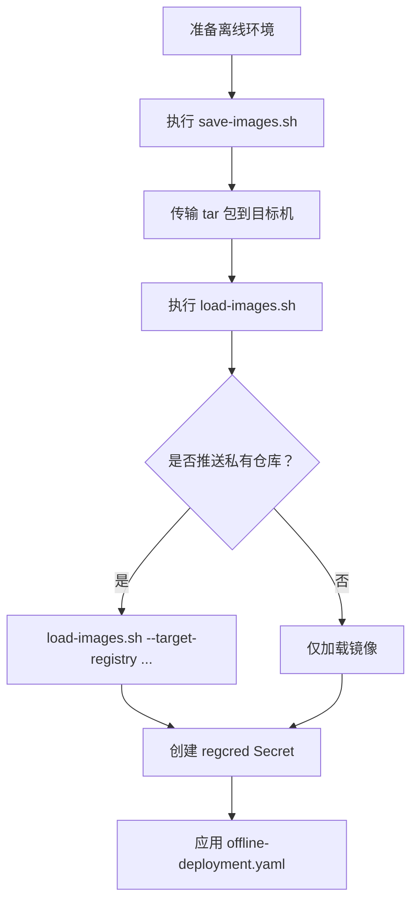
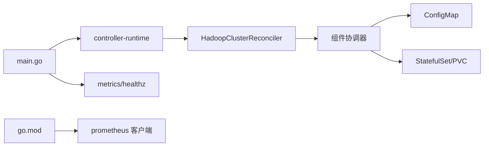

# 高级功能

<cite>
**本文引用的文件**
- [README.md](file://README.md)
- [main.go](file://cmd/main.go)
- [hadoopcluster_types.go](file://api/v1/hadoopcluster_types.go)
- [hadoopcluster_controller.go](file://internal/controller/hadoopcluster_controller.go)
- [ha.go](file://internal/reconciler/ha.go)
- [configmap.go](file://internal/reconciler/configmap.go)
- [namenode.go](file://internal/reconciler/namenode.go)
- [datanode.go](file://internal/reconciler/datanode.go)
- [hadoop_v1_hadoopcluster_ha.yaml](file://config/samples/hadoop_v1_hadoopcluster_ha.yaml)
- [offline-deployment.yaml](file://config/samples/offline-deployment.yaml)
- [save-images.sh](file://hack/offline/save-images.sh)
- [load-images.sh](file://hack/offline/load-images.sh)
- [go.mod](file://go.mod)
</cite>

## 目录
1. [简介](#简介)
2. [项目结构](#项目结构)
3. [核心组件](#核心组件)
4. [架构总览](#架构总览)
5. [详细组件分析](#详细组件分析)
6. [依赖分析](#依赖分析)
7. [性能考虑](#性能考虑)
8. [故障排查指南](#故障排查指南)
9. [结论](#结论)
10. [附录](#附录)

## 简介
本文件系统性阐述 Apache Hadoop Operator v3 的高级功能与实现要点，重点覆盖以下方面：
- 高可用架构：NameNode/ResourceManager 的 HA 配置、JournalNode 协调、ZooKeeper 集成或外部连接串
- 监控集成：Prometheus 指标导出与 ServiceMonitor 配置
- 存储管理：动态 PVC、StorageClass 选择、持久卷挂载策略
- 安全增强：Kerberos、TLS、Ranger 集成接口预留
- 离线部署：镜像打包/加载、私有仓库、离线集群部署流程

## 项目结构
该仓库采用标准的 Kubebuilder 项目布局，核心目录与职责如下：
- api/v1：CRD 类型定义（HadoopClusterSpec、MetricsSpec、SecuritySpec 等）
- internal/controller：主控制器（Reconciler），负责资源编排与状态更新
- internal/reconciler：各组件协调器（ConfigMap、NameNode、DataNode、HA、YARN 等）
- config/samples：示例 CR（含 HA 与离线部署）
- hack/offline：离线部署脚本（镜像保存/加载/推送）
- cmd/main.go：Operator 入口，包含指标与健康检查服务器配置
- go.mod：依赖声明（含 Prometheus 客户端）

**图表来源**
- [main.go:54-149](file://cmd/main.go#L54-L149)
- [hadoopcluster_controller.go:104-145](file://internal/controller/hadoopcluster_controller.go#L104-L145)
- [hadoopcluster_types.go:24-46](file://api/v1/hadoopcluster_types.go#L24-L46)
- [hadoop_v1_hadoopcluster_ha.yaml:1-107](file://config/samples/hadoop_v1_hadoopcluster_ha.yaml#L1-L107)
- [offline-deployment.yaml:1-135](file://config/samples/offline-deployment.yaml#L1-L135)
- [save-images.sh:1-66](file://hack/offline/save-images.sh#L1-L66)
- [load-images.sh:1-75](file://hack/offline/load-images.sh#L1-L75)
- [go.mod:1-69](file://go.mod#L1-L69)

**章节来源**
- [README.md:233-251](file://README.md#L233-L251)
- [go.mod:1-69](file://go.mod#L1-L69)

## 核心组件
- CRD 类型与规格
  - HadoopClusterSpec：统一承载镜像、HDFS、YARN、配置覆盖、安全、监控等字段
  - MetricsSpec：启用 Prometheus 指标与 ServiceMonitor
  - SecuritySpec：预留 Kerberos、TLS、Ranger 集成字段
- 控制器与协调器
  - 主控制器按顺序编排 ConfigMap、NameNode、DataNode、ResourceManager、NodeManager
  - 组件协调器分别处理服务、StatefulSet、PVC、探针与初始化脚本
- 离线工具链
  - save-images.sh：保存 Hadoop 与 ZooKeeper 镜像
  - load-images.sh：加载镜像并可选推送到私有仓库

**章节来源**
- [hadoopcluster_types.go:24-46](file://api/v1/hadoopcluster_types.go#L24-L46)
- [hadoopcluster_controller.go:104-145](file://internal/controller/hadoopcluster_controller.go#L104-L145)
- [save-images.sh:46-57](file://hack/offline/save-images.sh#L46-L57)
- [load-images.sh:46-74](file://hack/offline/load-images.sh#L46-L74)

## 架构总览
Operator 通过 Reconcile 循环驱动集群生命周期，从 CR 到最终状态的典型路径如下：

**图表来源**
- [main.go:119-149](file://cmd/main.go#L119-L149)
- [hadoopcluster_controller.go:104-145](file://internal/controller/hadoopcluster_controller.go#L104-L145)
- [configmap.go:44-68](file://internal/reconciler/configmap.go#L44-L68)
- [namenode.go:117-317](file://internal/reconciler/namenode.go#L117-L317)
- [datanode.go:115-321](file://internal/reconciler/datanode.go#L115-L321)

## 详细组件分析

### 高可用架构（NameNode/ResourceManager HA）
- NameNode HA
  - 至少 2 个副本；启用 HA 时自动注入 JournalNode 与 ZooKeeper（内部或外部）
  - 自动注入 fs.defaultFS 与 HA 相关属性，支持自动故障转移
- ResourceManager HA
  - 至少 2 个副本；启用 HA 时注入 YARN HA 相关属性与 ZooKeeper 地址
- JournalNode
  - 默认最小副本数为 3；支持独立 PVC 与资源限制
- ZooKeeper
  - 支持外部连接串或内部部署；内部部署默认 3 副本

**图表来源**
- [hadoopcluster_types.go:92-120](file://api/v1/hadoopcluster_types.go#L92-L120)
- [hadoopcluster_types.go:150-169](file://api/v1/hadoopcluster_types.go#L150-L169)
- [ha.go:35-177](file://internal/reconciler/ha.go#L35-L177)
- [ha.go:179-363](file://internal/reconciler/ha.go#L179-L363)
- [hadoop_v1_hadoopcluster_ha.yaml:12-88](file://config/samples/hadoop_v1_hadoopcluster_ha.yaml#L12-L88)

**章节来源**
- [hadoopcluster_types.go:92-120](file://api/v1/hadoopcluster_types.go#L92-L120)
- [hadoopcluster_types.go:150-169](file://api/v1/hadoopcluster_types.go#L150-L169)
- [ha.go:35-177](file://internal/reconciler/ha.go#L35-L177)
- [ha.go:179-363](file://internal/reconciler/ha.go#L179-L363)
- [hadoop_v1_hadoopcluster_ha.yaml:12-88](file://config/samples/hadoop_v1_hadoopcluster_ha.yaml#L12-L88)

### 监控集成（Prometheus 与 ServiceMonitor）
- 指标导出
  - 通过 MetricsSpec 启用指标与可选的 exporter 镜像
- ServiceMonitor
  - 通过 ServiceMonitorSpec 控制是否创建 ServiceMonitor，并匹配 Prometheus 实例标签
- 指标端点与安全
  - main.go 支持指标安全服务与 HTTP/2 禁用选项，便于在受控环境中部署

**图表来源**
- [hadoopcluster_types.go:273-295](file://api/v1/hadoopcluster_types.go#L273-L295)
- [hadoopcluster_controller.go:104-145](file://internal/controller/hadoopcluster_controller.go#L104-L145)
- [configmap.go:70-209](file://internal/reconciler/configmap.go#L70-L209)
- [main.go:97-119](file://cmd/main.go#L97-L119)

**章节来源**
- [hadoopcluster_types.go:273-295](file://api/v1/hadoopcluster_types.go#L273-L295)
- [hadoopcluster_controller.go:104-145](file://internal/controller/hadoopcluster_controller.go#L104-L145)
- [configmap.go:70-209](file://internal/reconciler/configmap.go#L70-L209)
- [main.go:97-119](file://cmd/main.go#L97-L119)

### 存储管理策略（PVC/StorageClass/动态卷）
- NameNode/DataNode/JournalNode 均支持：
  - 存储大小、StorageClass、访问模式（默认 ReadWriteOnce）
  - 通过 VolumeClaimTemplates 动态创建 PVC
- 初始化与权限
  - NameNode：初始化格式化（HA 与非 HA 分支）、日志目录 EmptyDir
  - DataNode：等待 NameNode 就绪、设置数据目录权限
- 亲和性与容忍度
  - 支持 Pod 反亲和性与容忍度，提升拓扑隔离与调度灵活性

**图表来源**
- [hadoopcluster_types.go:189-199](file://api/v1/hadoopcluster_types.go#L189-L199)
- [namenode.go:292-310](file://internal/reconciler/namenode.go#L292-L310)
- [datanode.go:296-314](file://internal/reconciler/datanode.go#L296-L314)
- [ha.go:338-356](file://internal/reconciler/ha.go#L338-L356)

**章节来源**
- [hadoopcluster_types.go:189-199](file://api/v1/hadoopcluster_types.go#L189-L199)
- [namenode.go:154-164](file://internal/reconciler/namenode.go#L154-L164)
- [datanode.go:147-157](file://internal/reconciler/datanode.go#L147-L157)
- [ha.go:250-256](file://internal/reconciler/ha.go#L250-L256)

### 安全增强（Kerberos/TLS/Ranger 接口）
- 结构预留
  - SecuritySpec 下包含 KerberosSpec、TLSSpec、RangerSpec 字段
- 当前实现
  - 未在协调器中直接落地具体注入逻辑，但 CRD 已预留相应字段，便于后续扩展
- 建议实践
  - Kerberos：通过 Secret 提供 keytab，结合 Hadoop/Kerberos 配置项启用安全
  - TLS：通过证书 Secret 注入，配合 Hadoop 相关 SSL 配置
  - Ranger：通过 Admin URL 与策略对接，结合 Hadoop 安全模块

**图表来源**
- [hadoopcluster_types.go:233-271](file://api/v1/hadoopcluster_types.go#L233-L271)

**章节来源**
- [hadoopcluster_types.go:233-271](file://api/v1/hadoopcluster_types.go#L233-L271)

### 离线部署能力
- 镜像准备与传输
  - 使用 save-images.sh 保存 Hadoop 与 ZooKeeper 镜像至 tar 包
  - 使用 load-images.sh 加载镜像，可选推送到私有仓库
- 私有仓库与拉取密钥
  - 通过 CR 中 image.pullSecrets 指定镜像拉取 Secret
- 离线集群部署
  - 使用 offline-deployment.yaml 指定私有仓库镜像与可选外部 ZooKeeper 连接串

**图表来源**
- [save-images.sh:46-57](file://hack/offline/save-images.sh#L46-L57)
- [load-images.sh:55-69](file://hack/offline/load-images.sh#L55-L69)
- [offline-deployment.yaml:7-14](file://config/samples/offline-deployment.yaml#L7-L14)
- [offline-deployment.yaml:22-23](file://config/samples/offline-deployment.yaml#L22-L23)

**章节来源**
- [README.md:84-127](file://README.md#L84-L127)
- [save-images.sh:46-57](file://hack/offline/save-images.sh#L46-L57)
- [load-images.sh:55-69](file://hack/offline/load-images.sh#L55-L69)
- [offline-deployment.yaml:7-14](file://config/samples/offline-deployment.yaml#L7-L14)
- [offline-deployment.yaml:22-23](file://config/samples/offline-deployment.yaml#L22-L23)

## 依赖分析
- 控制器与运行时
  - main.go 使用 controller-runtime 构建 Manager，注册指标与健康检查端点
  - 支持安全指标服务与 HTTP/2 禁用以规避相关漏洞
- Prometheus 客户端
  - go.mod 引入 Prometheus 客户端相关依赖，便于导出指标
- 组件间耦合
  - 主控制器按固定顺序编排组件，组件协调器通过 ConfigMap 提供 Hadoop 配置
  - HA 协调器负责 ZooKeeper/JournalNode，NameNode/DataNode 协调器负责各自的 StatefulSet/PVC

**图表来源**
- [main.go:97-119](file://cmd/main.go#L97-L119)
- [go.mod:40-46](file://go.mod#L40-L46)

**章节来源**
- [main.go:97-119](file://cmd/main.go#L97-L119)
- [go.mod:40-46](file://go.mod#L40-L46)

## 性能考虑
- 资源请求与限制
  - NameNode/DataNode/ResourceManager 默认存在最小资源请求/限制，可根据规模调整
- 存储与 IO
  - DataNode 默认较大存储容量；JournalNode 与 NameNode 数据目录均使用 PVC，注意 StorageClass 的吞吐与延迟
- 网络与拓扑
  - 通过反亲和性将关键组件分散到不同节点，降低单点风险
- 调度与容忍
  - 通过容忍度与污点策略，将组件调度到专用节点池

**章节来源**
- [namenode.go:140-152](file://internal/reconciler/namenode.go#L140-L152)
- [datanode.go:132-145](file://internal/reconciler/datanode.go#L132-L145)
- [hadoop_v1_hadoopcluster_ha.yaml:32-41](file://config/samples/hadoop_v1_hadoopcluster_ha.yaml#L32-L41)
- [hadoop_v1_hadoopcluster_ha.yaml:68-77](file://config/samples/hadoop_v1_hadoopcluster_ha.yaml#L68-L77)

## 故障排查指南
- 常见问题定位
  - Pod 启动失败：查看事件与上一次容器日志
  - NameNode 格式化失败：检查 PVC 状态与手动格式化（谨慎）
  - DataNode 无法连接 NameNode：检查网络连通性与配置
  - 镜像拉取失败：检查私有仓库镜像与 Secret 配置
- 建议步骤
  - 使用 kubectl describe pod 与 kubectl logs 定位
  - 检查 PVC/StorageClass 是否满足要求
  - 确认 Service/Headless Service 与端口映射正确

**章节来源**
- [README.md:276-318](file://README.md#L276-L318)

## 结论
Hadoop Operator v3 在 CRD 驱动下提供了完整的 HDFS/YARN 部署与运维能力，具备：
- 明确的 HA 设计（NameNode/ResourceManager）与 JournalNode/ZooKeeper 协同
- 可扩展的监控与安全接口（Prometheus、Kerberos、TLS、Ranger）
- 灵活的存储与离线部署工具链
建议在生产环境中结合容量规划、存储策略与安全策略进行定制化配置，并持续关注 Operator 的演进与社区最佳实践。

## 附录
- 示例 CR
  - HA 部署样例：启用 NameNode/ResourceManager HA、JournalNode、ServiceMonitor
  - 离线部署样例：私有仓库镜像、可选外部 ZooKeeper、禁用 ServiceMonitor
- 关键参数参考
  - MetricsSpec：metrics.enabled、serviceMonitor.enabled、labels
  - SecuritySpec：kerberos/tls/ranger 字段预留
  - StorageSpec：size、storageClassName、accessMode

**章节来源**
- [hadoop_v1_hadoopcluster_ha.yaml:101-107](file://config/samples/hadoop_v1_hadoopcluster_ha.yaml#L101-L107)
- [offline-deployment.yaml:122-126](file://config/samples/offline-deployment.yaml#L122-L126)
- [hadoopcluster_types.go:273-295](file://api/v1/hadoopcluster_types.go#L273-L295)
- [hadoopcluster_types.go:233-271](file://api/v1/hadoopcluster_types.go#L233-L271)