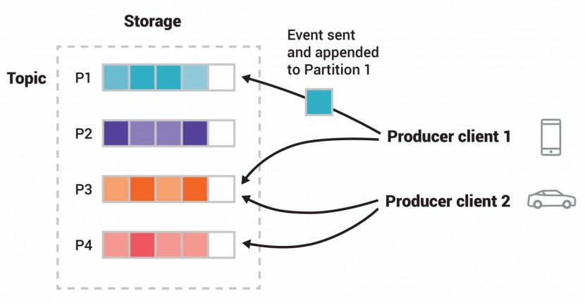

# 说明

官网`https://kafka.apache.org/`

基础知识`https://kafka.apache.org/intro/`

版本发布查询`https://kafka.apache.org/community/downloads/`

Kafka是一个event streaming 平台。

工作流程

1. 发布（写入）和订阅（读取）事件流，包括从其他系统持续导入/导出数据。
2. 持久可靠地存储事件流，存储时间长短随您所需。
3. 对正在发生的事件流进行处理，或进行回顾性处理。


适用于数据实时性要求高的场景。

由服务端和客户端组成，使用TCP协议通信。

 

kafka实现端到端event streaming的案例

1. 发布（写入）和订阅（读取）事件流，包括从其他系统持续导入/导出数据。
2. 在指定的存储时间长，持久可靠地存储事件流。
3. 对正在发生的事件流进行处理，或进行回顾性处理。

 

kafka以集群形态部署运行，集群由多个节点构成。角色broker的节点构建存储层。角色kafka connect的节点处理event streaming，实现持续的数据导入导出。

 

生产者。向kafka 发布（写入）event。

消费者。订阅（读取处理）event。

生产者与消费者完全解耦独立。

 

消费者对消息的处理，

At most once –Messages may be lost but are never redelivered.

At least once –Messages are never lost but may be redelivered.

Exactly once –Each message is processed once and only once.

至多一次——消息可能会丢失，但永远不会重新投递。

至少一次——消息永远不会丢失，但可能会重新投递。

恰好一次——每条消息只处理一次。

 

event被持久存储在topic中。

 

 

端到端低延迟的传递信息。

配置文件在目录`confi`g下。`config/server.properties`是配置文件

组件与JDK的兼容性清单`https://kafka.apache.org/43/getting-started/compatibility/`

# Kafka UI

web界面访问管理kafka，由第三方开发者提供。 

```bash
https://hub.docker.com/r/provectuslabs/kafka-ui
https://github.com/kafbat/kafka-ui
https://github.com/yahoo/CMAK
```

# 部署

支持docker环境和k8s环境。

## strimzi方法

参考`https://strimzi.io/`

代码仓库`https://github.com/orgs/strimzi/repositories`

配置文件参考`https://github.com/strimzi/strimzi-kafka-operator/tree/1.0.1/examples/kafka`
