# 说明

使用strimzi.io实现在k8s集群自动部署Apache Kafka集群。k8s必须是v1.30及以上版本。

文档`https://strimzi.io/documentation/`

示例配置`https://github.com/strimzi/strimzi-kafka-operator/tree/1.1.0/examples`

http bridg案例`https://strimzi.io/docs/bridge/latest/`


# 快速部署

使用strimzi快速部署Apache kafka

```bash
kubectl create namespace kafka
# 部署CRD和operator
kubectl create -f 'https://strimzi.io/install/latest?namespace=kafka' -n kafka
# 查询POD状态
kubectl get pod -n kafka --watch
```

可见下图，

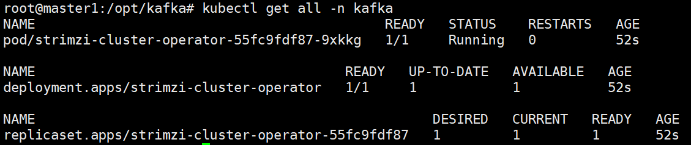


查看日志

```bash
kubectl logs deployment/strimzi-cluster-operator -n kafka -f
```

部署集群

```bash
kubectl apply -f https://strimzi.io/examples/latest/kafka/kafka-single-node.yaml -n kafka 
```

可见下图，

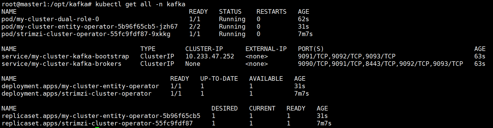


# 测试

发送消息

```bash
kubectl -n kafka run kafka-producer -ti --image=quay.io/strimzi/kafka:1.1.0-kafka-4.3.0 --rm=true --restart=Never -- bin/kafka-console-producer.sh --bootstrap-server my-cluster-kafka-bootstrap:9092 --topic my-topic
```

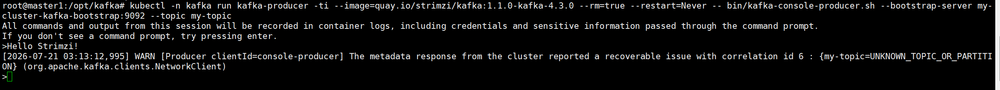


接收消息

```bash
kubectl -n kafka run kafka-consumer -ti --image=quay.io/strimzi/kafka:1.1.0-kafka-4.3.0 --rm=true --restart=Never -- bin/kafka-console-consumer.sh --bootstrap-server my-cluster-kafka-bootstrap:9092 --topic my-topic --from-beginning
```

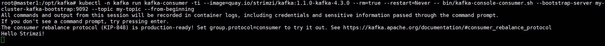

# 删除集群

```bash
kubectl -n kafka delete $(kubectl get strimzi -o name -n kafka)
```

删除PVC

```bash
kubectl delete pvc -l strimzi.io/name=my-cluster-kafka -n kafka
```

清理strimzi基础资源

```bash
kubectl -n kafka delete -f 'https://strimzi.io/install/latest?namespace=kafka'
```

删除namespace

```bash
kubectl delete namespace kafka
```

# 环境检查

若自定义配置部署，需参考此处往后。

确认k8s版本大于1.30

```bash
kubectl get node -A -o wide
```

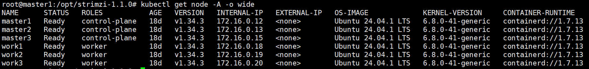

在需要部署Apache Kafka的k8s集群，每个集群仅部署一个Cluster Operator。一个operator可管理多个namespace中的kafka。

## 获取容器镜像

若希望离线部署，需获取离线镜像`https://quay.io/organization/strimzi`，中国地区可直连访问，若访问速度慢，可参考`1ms.run`配置加速。

## 创建专用namespace

```bash
kubectl create namespace kafka
```


## 创建集群角色

```bash
kubectl create -f install/strimzi-admin
```


# 部署-yaml文件方法

自定义配置部署，使用yaml文件。

## 准备文件

下载最新版本文件`https://github.com/strimzi/strimzi-kafka-operator/releases`

例如`https://github.com/strimzi/strimzi-kafka-operator/releases/download/1.1.0/strimzi-1.1.0.tar.gz`

上传至部署环境，解压文件

```bash
tar -zxf strimzi-1.1.0.tar.gz
cd strimzi-1.1.0/
```

内容如下，

```bash
root@master1:/opt/strimzi-1.1.0# ll
total 120
drwxr-xr-x  5 1001 1001   4096 Jun 26 21:36 ./
drwxr-xr-x 12 root root   4096 Jul 20 10:49 ../
-rw-r--r--  1 1001 1001 102106 Jun 26 21:35 CHANGELOG.md
drwxr-xr-x  4 1001 1001   4096 Jun 26 21:36 docs/
drwxr-xr-x 12 1001 1001   4096 Jun 26 21:35 examples/
drwxr-xr-x  8 1001 1001   4096 Jun 26 21:35 install/
```


## 部署cluster-operator

默认只监控指定namespace中的资源，注意，要指定明确的namespace，

```bash
sed -i 's/namespace: .*/namespace: kafka/' install/cluster-operator/*RoleBinding*.yaml
kubectl create -f install/cluster-operator -n kafka
```

若想同时监控多个namespace，参考`https://strimzi.io/docs/operators/latest/deploying#cluster-operator-str`


## 部署kafka

在目录`examples/kafka`中，存在多个yaml文件，

```bash
kafka/kafka-with-dual-role-nodes.yaml
部署一个 Kafka 集群，其中包含一个节点池，这些节点共享代理和控制器角色。

kafka/kafka-persistent.yaml
部署一个持久化的 Kafka 集群，其中包含一个控制器节点池和一个代理节点池。

kafka/kafka-ephemeral.yaml
部署一个临时的 Kafka 集群，其中包含一个控制器节点池和一个代理节点池。

kafka/kafka-single-node.yaml
部署一个单节点 Kafka 集群。

kafka/kafka-jbod.yaml
在每个代理节点上部署具有多个卷的 Kafka 集群。
```

选取自己期望使用的配置文件，部署资源

```bash
kubectl apply -f examples/kafka/kafka-with-dual-role-nodes.yaml -n kafka
```

查询

```bash
kubectl get all -n kafka
```

`my-cluster`是集群名字，`dual-role`是节点池名字。`my-cluster-entity-operator`是topic operator和user operator。

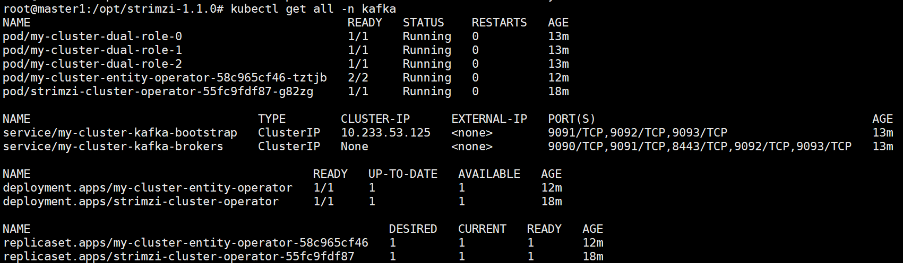

两个新增的operator由配置文件的指定配置决定，

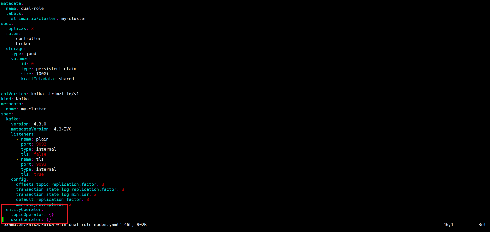


其他配置文件部署后，产生的资源有差异，详见`https://strimzi.io/docs/operators/latest/deploying#ref-list-of-kafka-cluster-resources-str`


## 部署kafka connect

示例文件是``examples/connect/kafka-connect.yaml``

部署

```bash
kubectl apply -f examples/connect/kafka-connect.yaml -n kafka
```

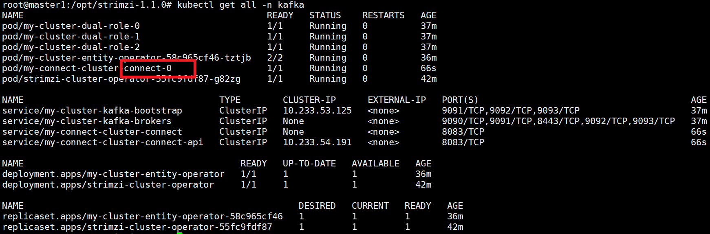


## 配置kafka connect连接器

构建专用容器镜像，下载驱动，参考`https://debezium.io/releases/`

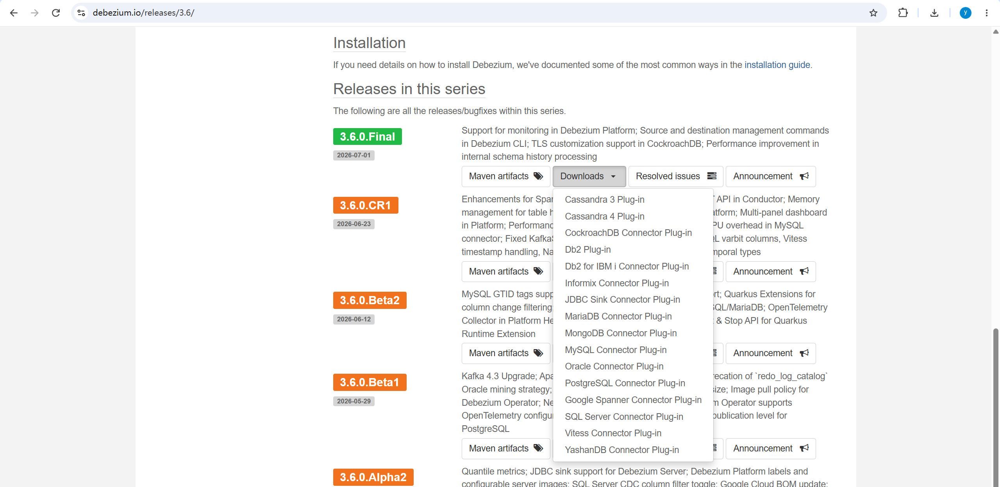

配置Dockerfile

```bash
FROM quay.io/strimzi/kafka:1.1.0-kafka-4.3.0
USER root:root
ADD ./plugins/*.tar.gz /opt/kafka/plugins/
USER 1001
```

目录结构如下所示，

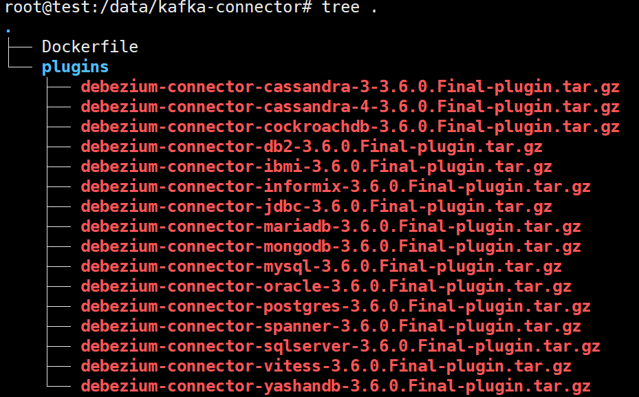

构建容器镜像，并推送到k8s集群可访问的容器镜像仓库。例如

```bash
docker build -t test:dev .
```


目前已有以下可用镜像

```bash
ccr.ccs.tencentyun.com/ruichuangdev/strimzi-kafka-connect:1.1.0-kafka-4.3.0
zhuyifeiruichuang/strimzi-kafka-connect:1.1.0-kafka-4.3.0
docker.cnb.cool/zhudev-2025/strimzi-kafka-connector-dev1/strimzi-kafka-connect:1.1.0-kafka-4.3.0
```


修改`examples/connect/kafka-connect.yaml`

```bash
apiVersion: kafka.strimzi.io/v1
kind: KafkaConnect
metadata:
  name: my-connect-cluster
  annotations:
#  # use-connector-resources configures this KafkaConnect
#  # to use KafkaConnector resources to avoid
#  # needing to call the Connect REST API directly
#    strimzi.io/use-connector-resources: "true"
    strimzi.io/use-connector-resources: "true"
spec:
  version: 4.3.0
  image: ccr.ccs.tencentyun.com/ruichuangdev/strimzi-kafka-connect:1.1.0-kafka-4.3.0
  replicas: 1
  bootstrapServers: my-cluster-kafka-bootstrap:9093
  groupId: my-connect-group
  configStorageTopic: my-connect-configs
  statusStorageTopic: my-connect-status
  offsetStorageTopic: my-connect-offsets
  tls:
    trustedCertificates:
      - secretName: my-cluster-cluster-ca-cert
        pattern: "*.crt"
  config:
    # -1 means it will use the default replication factor configured in the broker
    config.storage.replication.factor: -1
    offset.storage.replication.factor: -1
    status.storage.replication.factor: -1
```


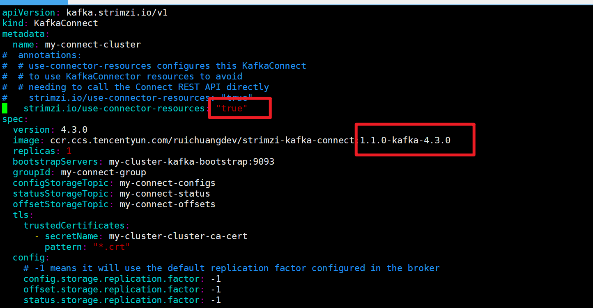

更新部署

```bash
kubectl apply -f examples/connect/kafka-connect.yaml -n kafka
```


修改`examples/connect/source-connector.yaml`

```bash
apiVersion: kafka.strimzi.io/v1
kind: KafkaConnector
metadata:
  name: my-source-connector
  labels:
    # The strimzi.io/cluster label identifies the KafkaConnect instance
    # in which to create this connector. That KafkaConnect instance
    # must have the strimzi.io/use-connector-resources annotation
    # set to true.
    strimzi.io/cluster: my-connect-cluster
spec:
  class: org.apache.kafka.connect.file.FileStreamSourceConnector
  tasksMax: 2
  autoRestart:
    enabled: true
  config:
    file: "/opt/kafka/LICENSE"
    topic: my-topic
```


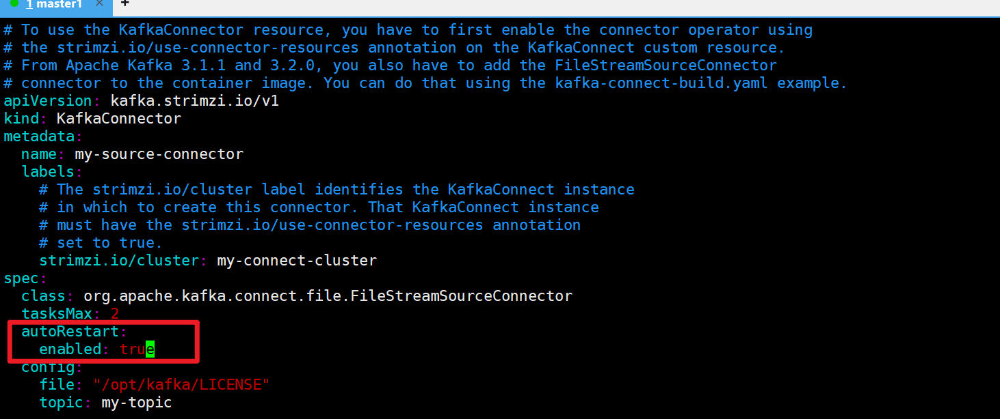


部署

```bash
kubectl apply -f examples/connect/source-connector.yaml -n kafka
```

修改文件`examples/connect/sink-connector.yaml`

```bash
apiVersion: kafka.strimzi.io/v1
kind: KafkaConnector
metadata:
  name: my-sink-connector
  labels:
    strimzi.io/cluster: my-connect-cluster
spec:
  class: org.apache.kafka.connect.file.FileStreamSinkConnector
  tasksMax: 2
  config:
    file: "/tmp/my-file"
    topics: my-topic
```

部署

```bash
kubectl apply -f examples/connect/sink-connector.yaml -n kafka
```


确认资源连接器是否连接

```bash
kubectl get kctr --selector strimzi.io/cluster=my-connect-cluster -o name -n kafka
```


测试topic读取

```bash
kubectl -n kafka exec my-cluster-dual-role-0 -it -- bin/kafka-console-consumer.sh \
  --bootstrap-server my-cluster-kafka-bootstrap.kafka.svc:9092 \
  --topic my-topic \
  --from-beginning
```

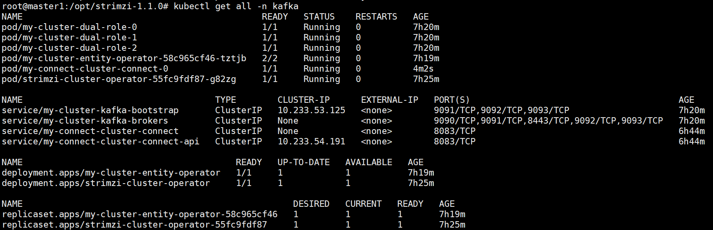


# 进展

`https://strimzi.io/docs/operators/latest/deploying#con-exposing-kafka-connect-api-str`

暂时不测试，内容过于多。


# 部署-OperatorHub.io方法

介绍内容太少，不使用。

参考`https://operatorhub.io/operator/strimzi-kafka-operator`

仅支持k8s v1.30及以上版本。要求能访问GitHub。

```bash
# 部署OLM工具
curl -sL https://github.com/operator-framework/operator-lifecycle-manager/releases/download/v0.45.0/install.sh | bash -s v0.45.0
# 自动部署
kubectl create -f https://operatorhub.io/install/strimzi-kafka-operator.yaml
# 查询部署结果
kubectl get csv -n operators
```

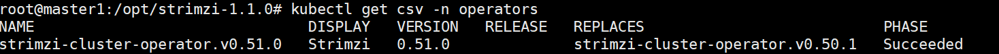


# 部署-helm方法


参考`https://strimzi.io/docs/operators/latest/deploying#deploying-cluster-operator-helm-chart-str`

