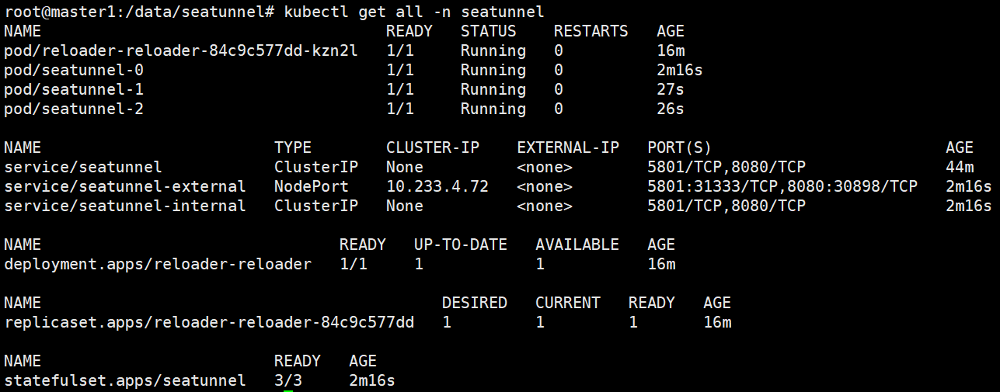
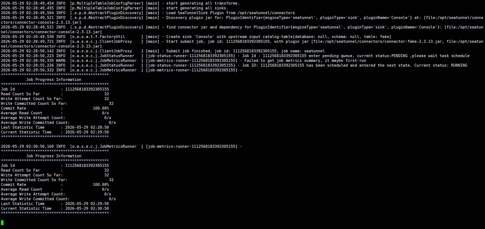

# 说明

Apache Seatunnel在kunernetes环境部署。支持离线部署。

采用Zeta(cluster mode) 模式。当前采用2.3.13版本，后续随官网及时更新。

# 参考资料

`https://seatunnel.apache.org/docs/2.3.13/getting-started/kubernetes/`


# 构建容器镜像

仅用于有定制镜像需求时。


`Dockerfile`内容，

```bash
FROM seatunnelhub/openjdk:8u342

ENV SEATUNNEL_VERSION="2.3.13"
ENV SEATUNNEL_HOME="/opt/seatunnel"

RUN wget https://dlcdn.apache.org/seatunnel/${SEATUNNEL_VERSION}/apache-seatunnel-${SEATUNNEL_VERSION}-bin.tar.gz
RUN tar -xzvf apache-seatunnel-${SEATUNNEL_VERSION}-bin.tar.gz
RUN mv apache-seatunnel-${SEATUNNEL_VERSION} ${SEATUNNEL_HOME}
RUN mkdir -p $SEATUNNEL_HOME/logs
RUN cd ${SEATUNNEL_HOME} && sh bin/install-plugin.sh ${SEATUNNEL_VERSION}
```


构建镜像

```bash
docker build -t seatunnel:2.3.13 -f Dockerfile .
```

导出为文件

```bash
docker save -o seatunnel.tar seatunnel:2.3.13
```


将镜像加载到k8s集群，注意，新版k8s只有ctr工具。

```bash
ctr -n k8s.io image import seatunnel.tar
```

# 创建namespace

```bash
kubectl create namespace seatunnel
```


# 创建配置文件

当前目录已有所有文件。

参考`https://github.com/apache/seatunnel/blob/2.3.13-release/config/v2.streaming.conf.template`

创建配置

```bash
kubectl create cm seatunnel-config --from-file=seatunnel.streaming.conf=seatunnel.streaming.conf -n seatunnel
```


创建配置

```bash
kubectl create configmap hazelcast-client  --from-file=hazelcast-client.yaml -n seatunnel
kubectl create configmap hazelcast  --from-file=hazelcast.yaml -n seatunnel
kubectl create configmap seatunnelmap  --from-file=seatunnel.yaml -n seatunnel
# 可选，用于日志持久化
kubectl create configmap log4j2.properties --from-file=log4j2.properties -n seatunnel
kubectl create configmap log4j2-client.properties --from-file=log4j2_client.properties -n seatunnel
```

# 创建reloader

下载文件`https://raw.githubusercontent.com/stakater/Reloader/master/deployments/kubernetes/reloader.yaml`

修改文件中的namespace部分为seatunnel

```bash
kubectl apply -f reloader.yaml -n seatunnel
```


# 创建seatunnel集群

注意：默认三副本，若调整副本数量，需调整configmap的hazelcast和hazelcast-client中的成员的完整服务名字。

```bash
kubectl apply -f seatunnel-cluster.yml -n seatunnel
```


# 修改configmap

此处可以优化到部署阶段，一次部署完成。


```bash
kubectl edit cm hazelcast -n seatunnel
```

改为

```bash
- seatunnel-0.seatunnel.default.svc.cluster.local
- seatunnel-1.seatunnel.default.svc.cluster.local
- seatunnel-2.seatunnel.default.svc.cluster.local
```

这是seatunnel的服务名


```bash
kubectl edit cm hazelcast-client
```

改为

```bash
- seatunnel-0.seatunnel.default.svc.cluster.local:5801
- seatunnel-1.seatunnel.default.svc.cluster.local:5801
- seatunnel-2.seatunnel.default.svc.cluster.local:5801
```

服务名和端口。

# 特殊配置说明

业务需求。非通用配置。

单独配置了8080端口，通过web界面查看信息。

单独配置了日志长期存储。

配置了对接HDFS，即Hadoop的namenode:9000

配置了单独的端口转发服务。

开启8080端口，配置端口nodeport类型的服务。

参考`https://seatunnel.apache.org/docs/2.3.13/engines/zeta/web-ui`


# 查询验证

```bash
# 查询资源状态
kubectl get all -n seatunnel
```





```bash
# 提交测试任务
kubectl exec -it -n seatunnel seatunnel-0 -- /opt/seatunnel/bin/seatunnel.sh --config /data/seatunnel.streaming.conf -n seatunnel
```




