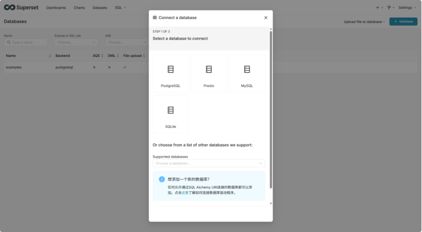

# 说明

在docker环境部署Apache Superset

参考`https://superset.apache.org/admin-docs/installation/docker-compose`

# 快速部署

```bash
git clone https://github.com/apache/superset
cd superset
# 注意，此处是当前最新版本分支。
git checkout tags/6.1.0
docker compose -f docker-compose-image-tag.yml up -d
```

# 访问

```bash
浏览器访问
http://节点IP:8088 
admin
admin
```

# 驱动缺失问题

参考`https://superset.apache.org/user-docs/databases/`

官网推荐使用临时配置方法补充驱动，推荐重新打包容器镜像解决驱动缺失问题。

做以下配置

```bash
root@monitor:/data/superset/superset/docker# cat requirements-local.txt 
pydoris
psycopg2
mysqlclient
pyhive
psycopg2
oracledb
```

实际效果有限，在web界面依旧会看不到部分数据库的驱动，是代码bug。

