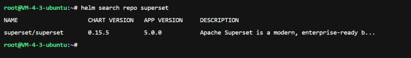

# 说明

在k8s环境部署Apache Superset

参考文档`https://superset.apache.org/admin-docs/installation/kubernetes/`

# 下载资源

找一台可以访问GitHub和docker  hub的云主机。其中docker hub可参考`1ms.run`配置加速。

参考`https://helm.sh/zh/docs/intro/install`快速安装helm工具，

使用helm下载资源包，

```bash
helm repo add superset https://apache.github.io/superset
helm repo update
helm search repo superset
```

可见下图，注意，版本随时可能更新变化，



```bash
helm pull superset/superset --version 0.15.5
tar -zxf superset-0.15.5.tgz
cd superset
# 若遇到失败，可修改value.yaml里的image部分为中国地区镜像。
helm dependency build
cd ..
helm package superset
```

拉取以下容器镜像

```bash
# 拉镜像
docker pull apachesuperset.docker.scarf.sh/apache/superset:latest
docker pull apachesuperset.docker.scarf.sh/apache/superset:6.1.0
docker pull docker.cnb.cool/zhudev-2025/apache-superset-dev:dev-6.1.0
docker pull apache/superset:dockerize
docker pull bitnamilegacy/postgresql:14.17.0-debian-12-r3
docker pull bitnamilegacy/redis:7.0.10-debian-11-r4

# 导出为tar离线包
docker save -o superset-main.tar apachesuperset.docker.scarf.sh/apache/superset:latest
docker save -o superset-main.tar apachesuperset.docker.scarf.sh/apache/superset:6.1.0
docker save -o docker.cnb.cool/zhudev-2025/apache-superset-dev:dev-6.1.0
docker save -o superset-dockerize.tar apache/superset:dockerize
docker save -o postgres.tar bitnamilegacy/postgresql:14.17.0-debian-12-r3
docker save -o redis.tar bitnamilegacy/redis:7.0.10-debian-11-r4
```

将上述内容复制到部署节点。

# 修改配置

修改`value.yaml`，文件来自`https://github.com/apache/superset/blob/master/helm/superset/values.yaml`

生成一个随机字符，

```bash
root@master1:/data/superset# openssl rand -base64 42
g+nrlyd8LhWedlJnQP8VwsEDuG229IrKWd56HouXClotzLHNIqNkoPFJ
```

`extraSecretEnv`改为

```bash
extraSecretEnv: {
  SUPERSET_SECRET_KEY: 'g+nrlyd8LhWedlJnQP8VwsEDuG229IrKWd56HouXClotzLHNIqNkoPFJ'
}
```

image部分务必确认是真实存在的镜像，可参考`1ms.run`配置加速。

# 部署

```bash
helm install superset ./superset-0.15.5.tgz \
  -n superset \
  --create-namespace \
  -f ./values.yaml
```

配置nodeport服务

```bash
kubectl apply -f superset-nodeport.yaml -n superset
```

# 访问

浏览器访问`master node1的IP:8088转发的端口`，账户密码`admin`


# 卸载

部署异常需卸载环境，

```bash
helm uninstall superset -n superset
```

