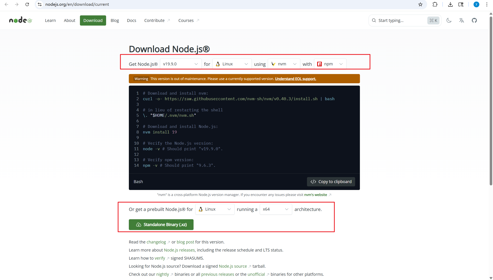
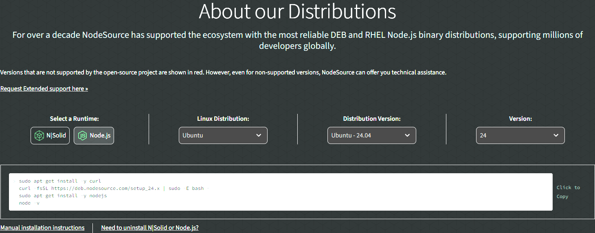

# 说明

部署任意版本的nodejs在Ubuntu环境。

# 离线部署-方案1

注意：此方案不适用于部分开源项目，例如Intel PCCS项目，无法识别到nodejs命令。

下载软件，浏览器访问`https://nodejs.org/en/download/current` ，勾选需使用的版本，下载xz后缀文件到当前目录。下图所示



将当前目录上传至需部署nodejs的环境，执行脚本，自动部署，若环境已有其他版本nodejs，脚本将配置新目录，不会覆盖旧数据。

```bash
bash deploy.sh
```


# 离线部署-方案2

单独下载rpm或deb软件包进行部署。

参考联网部署，配置nodejs的仓库，仅下载软件包，转移到需部署的环境安装软件包。

# 联网部署

浏览器访问`https://nodesource.com/products/distributions`

下图所示，选择runtime，适配的系统环境。复制获取的命令一键部署。


